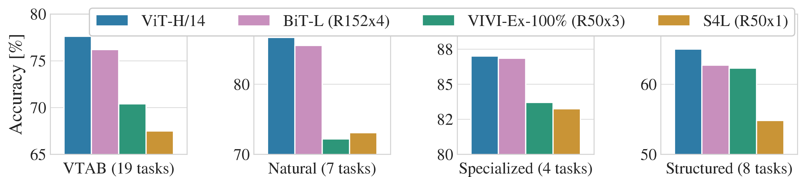
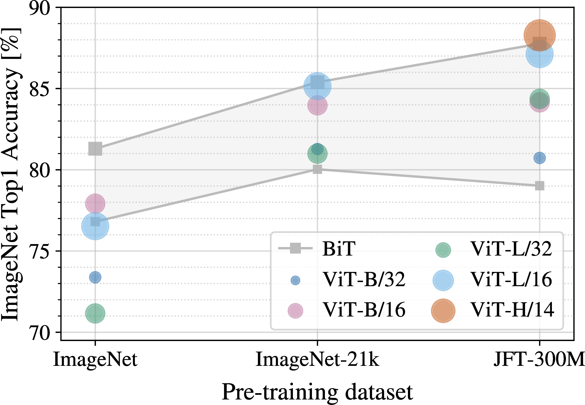
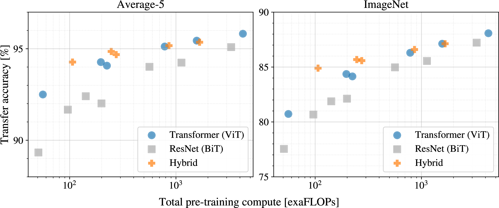
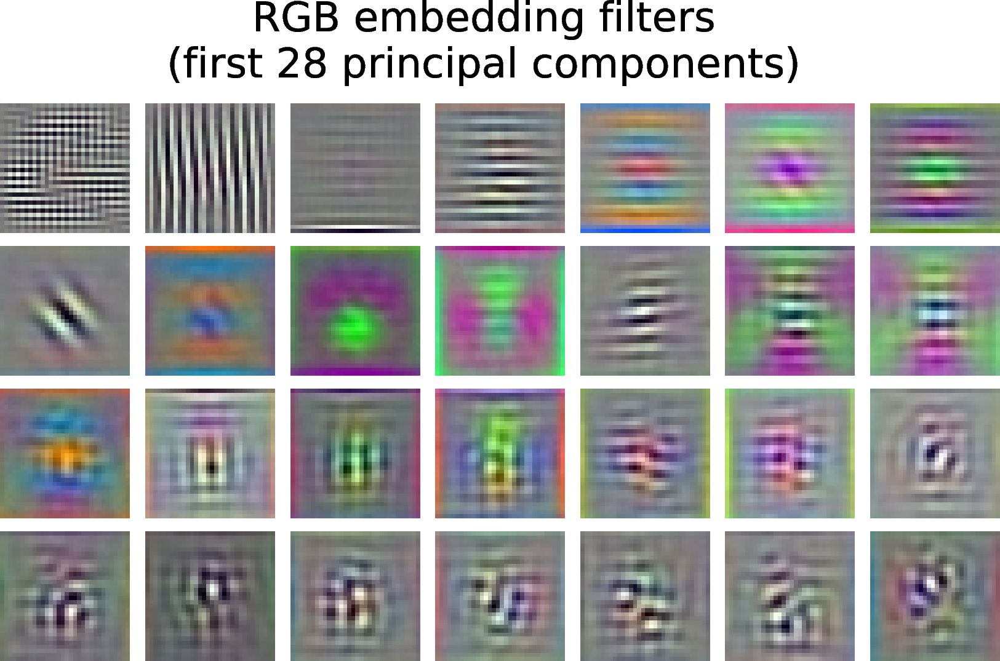
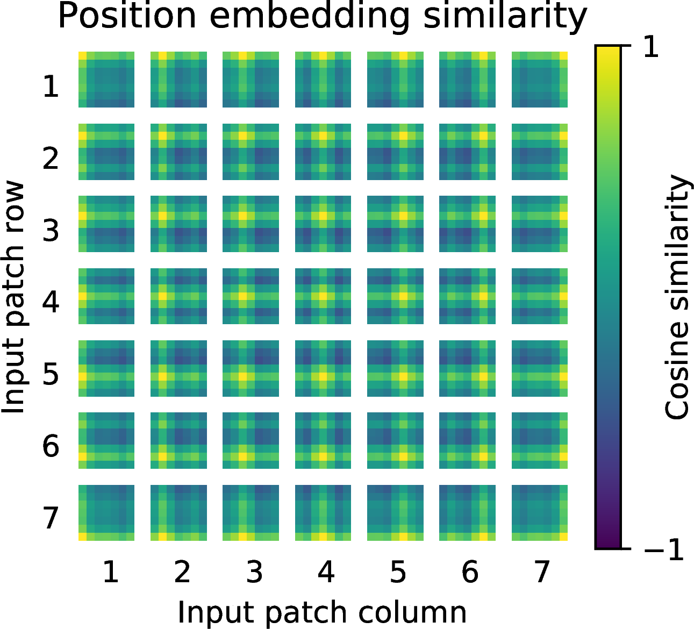
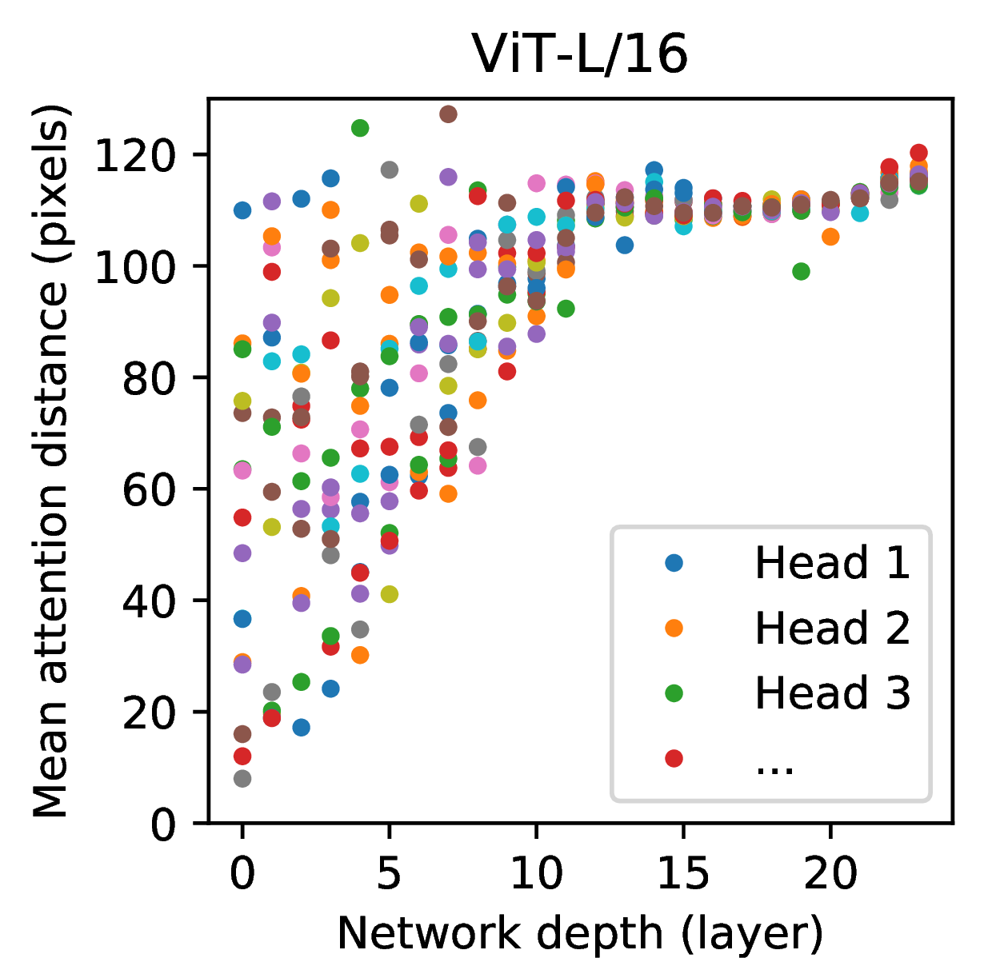
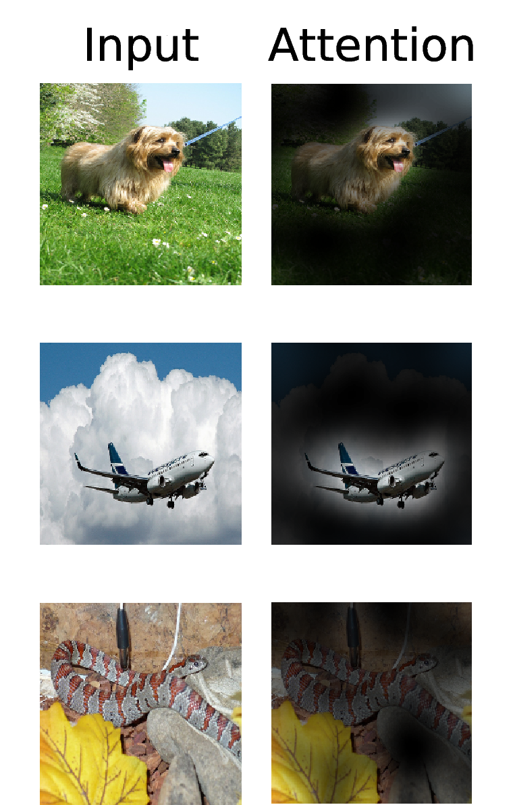

## Metadata and TL;DR

**Authors:** Alexey Dosovitskiy, Lucas Beyer, Alexander Kolesnikov, Dirk Weissenborn, Xiaohua Zhai, Thomas Unterthiner, Mostafa Dehghani, Matthias Minderer, Georg Heigold, Sylvain Gelly, Jakob Uszkoreit, Neil Houlsby (Google Research, Brain Team)

**Venue:** ICLR 2021

**Paper:** [An Image is Worth 16x16 Words](https://arxiv.org/abs/2010.11929) (arXiv:2010.11929)

**TL;DR:** The paper applies a standard Transformer encoder directly to sequences of image patches, with almost no vision-specific architectural changes. On mid-sized datasets like ImageNet alone, ViT underperforms comparable ResNets. When pre-trained on large datasets (ImageNet-21k or JFT-300M) and fine-tuned downstream, ViT matches or beats state-of-the-art CNNs on multiple benchmarks while using substantially less pre-training compute.

---

## Key Contributions

1. **Patch-sequence formulation:** Split an image into fixed-size patches, linearly embed each patch, add position embeddings, and feed the sequence to a standard Transformer encoder. Treat image patches the same way NLP treats word tokens.

2. **Scale beats inductive bias:** ViT lacks CNN inductive biases (locality, translation equivariance), so it needs large-scale pre-training. On JFT-300M, large ViT models outperform ResNets; on ImageNet alone, they lag behind.

3. **Competitive SOTA at lower compute:** ViT-H/14 pre-trained on JFT-300M reaches 88.55% on ImageNet, 90.72% on ImageNet-ReaL, 94.55% on CIFAR-100, and 77.63% on VTAB, while using 2.5k TPUv3-core-days versus 9.9k for BiT-L and 12.3k for Noisy Student.

4. **Analysis and extensions:** The paper studies hybrid CNN-Transformer models, scaling laws, internal representations (attention distance, position embeddings), and preliminary masked patch prediction for self-supervision.

---

## Problem and Motivation

Transformers dominate NLP, where models are pre-trained on large text corpora and fine-tuned on downstream tasks. In computer vision, convolutional architectures remain dominant. Prior work has combined CNNs with self-attention or replaced convolutions with specialized attention patterns, but those patterns have not scaled well on modern hardware.

The authors ask: **can a standard Transformer, with minimal modification, work for image recognition if trained at sufficient scale?**

The motivating observation from NLP is that computational efficiency and scalability let Transformers grow to 100B+ parameters without saturating. The authors test whether the same scaling recipe transfers to vision when images are treated as token sequences.

On ImageNet (1.3M images), ViT yields modest accuracies a few percentage points below comparable ResNets. The authors attribute this to missing inductive biases. On larger datasets (14M–300M images), the picture changes: **large-scale training trumps inductive bias.**

---

## Prerequisites and Notation

| Symbol | Meaning |
|---|---|
| $\mathbf{x} \in \mathbb{R}^{H \times W \times C}$ | Input image (height, width, channels) |
| $(P, P)$ | Patch size (e.g., 16×16) |
| $N = HW/P^2$ | Number of patches (sequence length) |
| $D$ | Hidden dimension (constant across Transformer layers) |
| $L$ | Number of Transformer encoder layers |
| $\mathbf{x}_p \in \mathbb{R}^{N \times (P^2 \cdot C)}$ | Flattened patch sequence |
| $\mathbf{x}_\text{class}$ | Learnable classification token (analogous to BERT `[CLS]`) |
| $\mathbf{E} \in \mathbb{R}^{(P^2 \cdot C) \times D}$ | Patch embedding projection matrix |
| $\mathbf{E}_\text{pos} \in \mathbb{R}^{(N+1) \times D}$ | Learnable 1D position embeddings |
| $\mathbf{y}$ | Image representation (output of classification token after encoder) |

**Model naming:** ViT-L/16 means the Large variant with 16×16 input patches. Sequence length scales as $1/P^2$, so smaller patches mean longer sequences and higher compute.

**Model variants (from Table 1 in the paper):**

| Model | Layers | Hidden size $D$ | MLP size | Heads | Params |
|---|---|---|---|---|---|
| ViT-Base | 12 | 768 | 3072 | 12 | 86M |
| ViT-Large | 24 | 1024 | 4096 | 16 | 307M |
| ViT-Huge | 32 | 1280 | 5120 | 16 | 632M |

---

## Method

### Overview: Image Patches as Tokens

{#fig-vit-architecture}

The pipeline has four steps:

1. **Patchify:** Reshape $\mathbf{x}$ into a sequence of flattened 2D patches $\mathbf{x}_p$.
2. **Embed:** Linearly project each patch to dimension $D$.
3. **Prepend class token:** Add a learnable $\mathbf{x}_\text{class}$ embedding at the front of the sequence.
4. **Encode:** Pass the sequence through a standard Transformer encoder. The final layer-norm output of the class token is the image representation $\mathbf{y}$.

The classification head is an MLP with one hidden layer during pre-training and a single linear layer during fine-tuning.

### Patch Embedding and Encoder Equations

The core ViT equations from Section 3 of the paper:

$$
\mathbf{z}_0 = [ \mathbf{x}_\text{class}; \, \mathbf{x}^1_p \mathbf{E}; \, \mathbf{x}^2_p \mathbf{E}; \cdots; \, \mathbf{x}^{N}_p \mathbf{E} ] + \mathbf{E}_{pos}, \quad \mathbf{E} \in \mathbb{R}^{(P^2 \cdot C) \times D},\, \mathbf{E}_{pos}  \in \mathbb{R}^{(N + 1) \times D}
$$ {#eq-embedding}

- $\mathbf{z}_0$: initial sequence of token embeddings fed to the encoder (class token plus $N$ patch tokens).
- $\mathbf{x}^i_p \mathbf{E}$: the $i$-th patch, flattened to length $P^2 C$, multiplied by the trainable projection $\mathbf{E}$ to produce a $D$-dimensional patch embedding.
- $\mathbf{E}_\text{pos}$: learnable position embeddings added to every token. The paper uses standard 1D position embeddings; 2D-aware variants did not help (Appendix).

Each encoder layer alternates multi-head self-attention (MSA) and MLP blocks with pre-layer-norm and residual connections:

$$
\mathbf{z'}_\ell = \operatorname{MSA}(\operatorname{LN}(\mathbf{z}_{\ell-1})) + \mathbf{z}_{\ell-1}, \quad \ell=1\ldots L
$$ {#eq-msa-apply}

$$
\mathbf{z}_\ell = \operatorname{MLP}(\operatorname{LN}(\mathbf{z'}_{\ell})) + \mathbf{z'}_{\ell}, \quad \ell=1\ldots L
$$ {#eq-mlp-apply}

$$
\mathbf{y} = \operatorname{LN}(\mathbf{z}_L^0)
$$ {#eq-final-rep}

- $\mathbf{z}_L^0$: the class token (index 0) after $L$ encoder layers.
- $\mathbf{y}$: the image representation used for classification.
- MLP: two layers with GELU non-linearity.

### Multi-Head Self-Attention (Appendix A)

Standard self-attention from the appendix:

$$
[\mathbf{q}, \mathbf{k}, \mathbf{v}] = \mathbf{z} \mathbf{U}_{qkv}, \quad \mathbf{U}_{qkv} \in \mathbb{R}^{D \times 3 D_h}
$$ {#eq-qkv}

$$
A = \operatorname{softmax}\left(\mathbf{q}\mathbf{k}^\top / \sqrt{D_h}\right), \quad A \in \mathbb{R}^{N \times N}
$$ {#eq-attn-matrix}

$$
\operatorname{SA}(\mathbf{z}) = A\mathbf{v}
$$ {#eq-selfattn}

Multi-head self-attention runs $k$ parallel self-attention heads and projects the concatenated outputs:

$$
\operatorname{MSA}(\mathbf{z}) = [\operatorname{SA}_1(z); \operatorname{SA}_2(z); \cdots ; \operatorname{SA}_k(z)] \, \mathbf{U}_{msa}, \quad \mathbf{U}_{msa} \in \mathbb{R}^{k \cdot D_h \times D}
$$ {#eq-msa}

When changing the number of heads $k$, $D_h$ is set to $D/k$ to keep compute and parameters constant.

### Inductive Bias: ViT vs. CNN

ViT has **much less image-specific inductive bias** than CNNs:

- **CNNs:** Locality, 2D neighborhood structure, and translation equivariance are built into every layer.
- **ViT:** Only MLP layers are local and translationally equivariant. Self-attention layers are global. 2D structure appears only when cutting the image into patches and when interpolating position embeddings at fine-tuning time.

At initialization, position embeddings carry no 2D information. All spatial relationships between patches must be learned from data.

### Hybrid Architecture

Instead of raw image patches, the input sequence can come from feature maps of a CNN. The patch embedding projection $\mathbf{E}$ is applied to patches extracted from the CNN feature map. If patches have spatial size 1×1, the sequence is obtained by flattening the spatial dimensions of the feature map and projecting to $D$.

Hybrid models (e.g., R50+ViT-B/16) are tested throughout the experiments. They help at small compute budgets but the gap vanishes for larger models.

### Fine-Tuning and Higher Resolution

Pre-training typically uses 224×224 resolution. Fine-tuning often uses higher resolution (384 default; 512 for ViT-L/16 and 518 for ViT-H/14 on ImageNet SOTA runs).

When resolution increases, patch size stays fixed, so sequence length grows. Pre-trained position embeddings are adjusted via **2D interpolation** based on their location in the original image. This resolution adjustment is one of the only places where 2D image structure is manually injected.

For downstream transfer, the pre-trained prediction head is removed and replaced with a zero-initialized $D \times K$ linear layer ($K$ = number of downstream classes). The paper found replacing the entire head (not just the last layer) to be more robust.

---

## Experiments and Results

### Datasets and Setup

**Pre-training datasets:**

- **ImageNet (ILSVRC-2012):** 1k classes, 1.3M images
- **ImageNet-21k:** 21k classes, 14M images
- **JFT-300M:** 18k classes, 303M high-resolution images

Pre-training datasets are de-duplicated against downstream test sets.

**Downstream benchmarks:** ImageNet (original and ReaL labels), CIFAR-10/100, Oxford-IIIT Pets, Oxford Flowers-102, VTAB (19 tasks, 1000 training examples each).

**Training:** Adam ($\beta_1=0.9$, $\beta_2=0.999$), batch size 4096, weight decay 0.1, linear LR warmup and decay. ResNet baselines use Group Normalization and standardized convolutions ("ResNet (BiT)").

**Fine-tuning:** SGD with momentum 0.9, batch size 512. For ImageNet SOTA: higher resolution fine-tuning plus Polyak averaging (factor 0.9999).

**Metrics:** Fine-tuning accuracy (main) and few-shot linear accuracy (closed-form regularized least-squares on frozen representations).

### Comparison to State of the Art

| | ViT-H/14 (JFT) | ViT-L/16 (JFT) | ViT-L/16 (I21k) | BiT-L | Noisy Student |
|---|---|---|---|---|---|
| ImageNet | 88.55±0.04 | 87.76±0.03 | 85.30±0.02 | 87.54±0.02 | 88.4/88.5* |
| ImageNet ReaL | 90.72±0.05 | 90.54±0.03 | 88.62±0.05 | 90.54 | 90.55 |
| CIFAR-100 | 94.55±0.04 | 93.90±0.05 | 93.25±0.05 | 93.51±0.08 | — |
| VTAB (19 tasks) | 77.63±0.23 | 76.28±0.46 | 72.72±0.21 | 76.29±1.70 | — |
| TPUv3-core-days | 2.5k | 0.68k | 0.23k | 9.9k | 12.3k |

ViT-L/16 on JFT outperforms BiT-L on all tasks with substantially less compute. ViT-H/14 further improves on harder datasets. ViT-L/16 on ImageNet-21k can be trained on a standard 8-core TPUv3 in ~30 days.

{#fig-vtab-breakdown}

On VTAB, ViT-H/14 outperforms BiT and other methods on *Natural* and *Structured* tasks. On *Specialized* (medical/satellite), top models perform similarly.

### Pre-Training Data Requirements

{#fig-imagenet-scaling}

{#fig-jft-data}

Two key findings:

1. **Dataset size vs. model size:** On ImageNet pre-training, ViT-Large underperforms ViT-Base despite regularization. On ImageNet-21k, they tie. Only on JFT-300M do larger models show their full benefit.

2. **ViT vs. ResNet by data scale:** BiT ResNets beat ViT on ImageNet pre-training. With larger datasets, ViT overtakes. On JFT subsets (9M, 30M, 90M), ViTs overfit more on small subsets but surpass ResNets at 90M+. The convolutional inductive bias helps on small data; learning patterns directly from data wins at scale.

### Scaling Study

{#fig-scaling-architectures}

Controlled scaling on JFT-300M (7 ResNets, 6 ViTs, 5 hybrids):

1. **ViTs dominate ResNets** on the performance/compute trade-off (~2–4× less compute for the same average performance across 5 datasets).
2. **Hybrids slightly outperform ViT** at small budgets; the gap vanishes for larger models.
3. **ViTs do not saturate** within the range tested, motivating further scaling.

### Inspecting ViT Internals

{#fig-filter-pca}

{#fig-pos-emb}

{#fig-attention-distance}

{#fig-attention-examples}

**Patch embedding filters:** Top principal components of the learned linear embedding resemble plausible basis functions for fine within-patch structure.

**Position embeddings:** The model learns to encode distance: closer patches have more similar position embeddings. Row-column structure appears. This explains why hand-crafted 2D-aware embeddings did not help.

**Attention distance:** Analogous to receptive field size in CNNs. Some heads attend globally even in the lowest layers. Others have small attention distances in low layers (less pronounced in hybrids, suggesting a role similar to early conv layers). Attention distance grows with depth. The model attends to semantically relevant regions for classification.

### Self-Supervision (Preliminary)

The authors test **masked patch prediction** (BERT-style): corrupt 50% of patch embeddings (80% replaced with `[mask]`, 10% random patch, 10% unchanged), then predict the 3-bit mean color (512 colors) of corrupted patches.

ViT-B/16 with self-supervised pre-training on JFT reaches **79.9%** on ImageNet, a 2% gain over training from scratch but **4% below** supervised pre-training. Contrastive pre-training is left for future work.

---

## Critical Analysis

### Strengths

- **Conceptual simplicity:** Reuses standard NLP Transformer architecture with minimal vision-specific changes. Enables direct use of scalable NLP implementations.
- **Strong empirical scaling story:** Clear evidence that large pre-training compensates for missing CNN inductive biases.
- **Compute efficiency:** State-of-the-art or near-SOTA results at 2–4× lower pre-training cost than BiT and Noisy Student.
- **Thorough analysis:** Scaling curves, data-efficiency studies, hybrid comparisons, and attention/embedding visualizations build intuition beyond headline numbers.

### Weaknesses and Limitations (as stated by authors)

- **Data hunger on small/medium datasets:** Without large-scale pre-training, ViT underperforms ResNets. ImageNet-only training is insufficient for large ViT variants.
- **Limited task scope:** Experiments focus on image classification. Detection and segmentation are listed as future work (though DETR results are cited as promising).
- **Self-supervision gap:** Masked patch prediction helps but leaves a 4% gap versus supervised pre-training on ImageNet.
- **Position embedding interpolation:** Higher-resolution fine-tuning requires heuristic 2D interpolation of 1D position embeddings; this is a manual injection of spatial structure.
- **Hybrid surprise:** One might expect CNN local features to always help ViT; the paper shows the benefit disappears at scale, but does not fully explain why.

### Gaps Between Claims and Evidence

- The "16x16 words" framing is catchy but the paper also uses 14×14 and 32×32 patches; compute/accuracy trade-offs depend heavily on patch size.
- Few-shot VTAB results are "promising" but VTAB-H/14 at 77.63% is only marginally above BiT-L (76.29% ± 1.70); variance matters on low-data tasks.
- Self-supervision experiments are explicitly preliminary (1M steps, single objective variant reported).

---

## Practical Takeaways

### Pre-Training Hyperparameters (JFT-300M, from Appendix)

| Model | Epochs | Base LR | Weight decay | Dropout |
|---|---|---|---|---|
| ViT-B/{16,32} | 7 | 8×10⁻⁴ | 0.1 | 0.0 |
| ViT-L/16 | 7/14 | 4×10⁻⁴ | 0.1 | 0.0 |
| ViT-H/14 | 14 | 3×10⁻⁴ | 0.1 | 0.0 |

All models: batch size 4096, 10k-step LR warmup, linear decay, 224×224 training resolution.

### ImageNet-Only Training (requires strong regularization)

| Setting | Value |
|---|---|
| Epochs | 300 |
| Base LR | 3×10⁻³ |
| LR schedule | Cosine |
| Weight decay | 0.3 |
| Dropout | 0.1 |
| Gradient clipping | Global norm 1 |

Dropout applies after every dense layer except QKV projections and right after adding positional to patch embeddings.

### Fine-Tuning Defaults

- **Optimizer:** SGD, momentum 0.9
- **Batch size:** 512
- **LR schedule:** Cosine decay
- **Weight decay:** 0 (during fine-tuning)
- **Gradient clipping:** Global norm 1
- **Default resolution:** 384×384
- **Head replacement:** Remove entire pre-trained head; attach single zero-initialized linear layer

### Reproduction Tips

- Code and pre-trained models: [google-research/vision_transformer](https://github.com/google-research/vision_transformer)
- Adam with high weight decay (0.1) works better than SGD for pre-training ResNets in this setup (contrary to common practice).
- For ImageNet SOTA numbers: fine-tune ViT-L/16 at 512 and ViT-H/14 at 518 with Polyak averaging (0.9999).
- Smaller patch size = longer sequence = more compute; ViT-L/16 is the sweet spot for many benchmarks.

---

## Related Work and Lineage

**Direct predecessors:**

- **Transformer (Vaswani et al., 2017):** Architecture ViT adopts with minimal changes.
- **BERT (Devlin et al., 2019):** `[CLS]` token and pre-train/fine-tune recipe; masked prediction inspires ViT self-supervision experiments.
- **BiT (Kolesnikov et al., 2020):** ResNet baseline and transfer protocol; ViT is trained and evaluated under the same framework.

**Closest related model:**

- **Cordonnier et al. (2020):** Also applies full self-attention on 2×2 patches. ViT goes further by showing large-scale pre-training makes vanilla Transformers competitive with SOTA CNNs, and handles medium-resolution images (16×16 patches).

**Other relevant lines:**

- Local/sparse/axial attention for vision (Image Transformer, Sparse Transformers, Axial Attention) require specialized patterns; ViT uses global attention.
- CNN + attention hybrids (Attention Augmented CNN, DETR, Non-local NN).
- **iGPT (Chen et al., 2020):** Transformer on reduced-resolution pixels; generative unsupervised training; max 72% on ImageNet.
- Large-scale image recognition (Mahajan et al., Touvron et al., Noisy Student, Sun et al. on JFT scaling).

**What ViT changed:** Prior work treated Transformers as a component inside CNN pipelines or used restricted attention. ViT shows that with enough data, the **simplest** approach (patches → Transformer) is enough.

---

## References

1. Dosovitskiy, A., Beyer, L., Kolesnikov, A., et al. (2021). *An Image is Worth 16x16 Words: Transformers for Image Recognition at Scale.* ICLR 2021. [https://arxiv.org/abs/2010.11929](https://arxiv.org/abs/2010.11929)

2. Vaswani, A., et al. (2017). *Attention Is All You Need.* NeurIPS 2017.

3. Devlin, J., et al. (2019). *BERT: Pre-training of Deep Bidirectional Transformers for Language Understanding.* NAACL 2019.

4. Kolesnikov, A., et al. (2020). *Big Transfer (BiT): General Visual Representation Learning.* ECCV 2020.

5. Cordonnier, J.-B., et al. (2020). *On the Relationship between Self-Attention and Convolutional Layers.* ICLR 2020.

6. Chen, M., et al. (2020). *Generative Pretraining from Pixels (iGPT).* ICML 2020.

7. Xie, Q., et al. (2020). *Self-Training with Noisy Student improves ImageNet classification.* CVPR 2020.

8. Zhai, X., et al. (2019). *VTAB: The Visual Task Adaptation Benchmark.* arXiv:1910.04867.

9. Sun, C., et al. (2017). *Revisiting Unreasonable Effectiveness of Data in Deep Learning Era.* ICCV 2017. (JFT dataset)

10. Fine-tuning code and models: [https://github.com/google-research/vision_transformer](https://github.com/google-research/vision_transformer)
