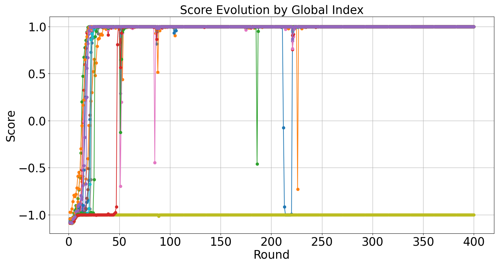

## From REINFORCE to PPO {#sec-policy-gradients}

::: {.callout-note collapse="true" title="Sources for this section"}

| # | Source | Summary |
|---|---|---|
| 1 | [DeepSeekMath](https://arxiv.org/abs/2402.03300) | PPO objective (Eq 1-2), value function overhead, KL penalty |
| 2 | [Dr. GRPO](https://arxiv.org/abs/2503.20783) | Full Monte Carlo PG derivation, baseline theory, advantage definition |
| 3 | [REINFORCE++](https://arxiv.org/abs/2501.03262) | REINFORCE for LLMs, architecture comparison with GRPO |

:::

Ava wants to train her SQL model to learn from its own mistakes. She can generate SQL, run it, and get a [**reward**]{style="color: #047857;"}: 1 if the output matches the expected result, 0 otherwise. But how does she turn this reward signal into a gradient that updates her model's parameters? The model generates tokens one at a time, autoregressively. The reward arrives only at the very end, after the entire SQL query is complete. There is no obvious way to take the derivative of a binary "correct/incorrect" signal with respect to millions of neural network weights. This credit-assignment problem is what policy gradient methods solve, and understanding these methods is essential to grasping why [**GRPO**]{style="color: #4F46E5;"} works the way it does.

### The Policy Gradient Theorem

Let us formalize the setup. Ava's LLM is a **policy** $\pi_\theta$: given a question $q$ (like "What were last quarter's top sellers?"), it generates an output sequence $o = (o_1, o_2, \ldots, o_T)$ by sampling tokens one at a time. Each token $o_t$ is sampled from the distribution $\pi_\theta(o_t \mid q, o_{<t})$, conditioned on the question and all tokens generated so far. After the full output is generated, a reward function $R(q, o)$ evaluates it. For Ava's SQL task, $R(q, o) = 1$ if executing the generated SQL returns the correct results, and $R(q, o) = 0$ otherwise.

The goal of RL training is to find parameters $\theta$ that maximize the expected reward:

$$
\mathcal{J}(\pi_\theta) = \mathbb{E}_{q \sim p_\mathcal{Q}} \left[ \mathbb{E}_{o \sim \pi_\theta(\cdot \mid q)} \left[ R(q, o) \right] \right]
$$ {#eq-rl-objective}

The expectation is over two sources of randomness: the distribution of training questions $p_\mathcal{Q}$, and the stochastic sampling from the policy itself. The key technique at the heart of all policy gradient methods is the **log-derivative trick** (also called the [**REINFORCE**]{style="color: #4F46E5;"} trick or the score function estimator; see @sec-math-log-derivative for the full derivation). The gradient of @eq-rl-objective with respect to $\theta$ can be written as:

$$
\nabla_\theta \mathcal{J}(\pi_\theta) = \mathbb{E}_{q, o \sim \pi_\theta} \left[ \nabla_\theta \log \pi_\theta(o \mid q) \cdot R(q, o) \right]
$$ {#eq-policy-gradient}

Since $\log \pi_\theta(o \mid q) = \sum_{t=1}^{|o|} \log \pi_\theta(o_t \mid q, o_{<t})$, the gradient becomes a sum over tokens, each weighted by the total reward. The gradient says: if output $o$ received a high reward, increase the log-probability of every token in that output; if it received a low reward, decrease them.

No differentiation through the reward function is needed. The reward can be completely non-differentiable (a binary "correct/incorrect," a database execution result, a compilation check), and the gradient is still well-defined.

Let us make this concrete with Ava's SQL model. Suppose for the question "What were top sellers last quarter?", the model generates `SELECT product_name FROM orders JOIN products ... WHERE quarter = 'Q3'`. After execution, this query returns the correct result, so $R = 1$. The gradient tells us: increase the probability of every token in this query. Next, for the same question, the model generates `SELECT * FROM products WHERE region = 'Northwest'`, which returns wrong results, so $R = 0$. The gradient contribution is zero for this output (multiplied by $R = 0$), so the failed query contributes nothing. That approach seems fine, except for a devastating problem.

### The Variance Problem

Here is what happens in practice when Ava tries this approach. She samples one output per question, computes the reward (0 or 1), and updates the model. In one batch, suppose she processes 32 questions. Maybe 8 produce correct SQL (reward 1), and 24 produce incorrect SQL (reward 0). The gradient from the 8 correct outputs pushes the model to reinforce those patterns. The 24 incorrect outputs contribute nothing (reward 0 means they vanish). In the next batch, a completely different set of 6 questions might happen to produce correct SQL by chance, pulling the model in a different direction. The gradient estimates vary wildly from batch to batch.

This oscillation is the [**high variance problem**]{style="color: #E11D48;"} of Monte Carlo policy gradients (see @sec-math-expectation-variance for a review of variance and the sample mean). With binary rewards, the gradient is either the full log-probability gradient (reward 1) or zero (reward 0). The signal is extremely noisy, and training oscillates instead of converging.

For Ava's model, after thousands of updates, accuracy barely improves because each update is as likely to help as to hurt. The gradient estimates simply do not agree with each other.

### Baselines: Reducing Variance Without Introducing Bias

The key insight for taming this variance is subtracting a [**baseline**]{style="color: #B45309;"} $B(q)$ from the reward. Instead of weighting gradients by $R(q, o)$, we weight them by $R(q, o) - B(q)$:

$$
\nabla_\theta \mathcal{J}(\pi_\theta) = \mathbb{E}_{q, o \sim \pi_\theta} \left[ \sum_{t=1}^{|o|} \nabla_\theta \log \pi_\theta(o_t \mid q, o_{<t}) \left( R(q, o) - B(q) \right) \right]
$$ {#eq-reinforce-baseline}

The quantity $A(q, o) = R(q, o) - B(q)$ is called the [**advantage**]{style="color: #B45309;"}: how much better (or worse) was this specific output compared to the baseline expectation? Here is the critical mathematical fact: subtracting any baseline that does not depend on the current action $o_t$ does not change the expected gradient (see @sec-math-unbiased-estimators for why this unbiasedness property holds). The proof, from Dr. GRPO ([Liu et al., 2025](https://arxiv.org/abs/2503.20783), Appendix A), is elegant. For any baseline $B(q)$ that is independent of the action:

$$
\mathbb{E}_{o_t \sim \pi_\theta(\cdot \mid q, o_{<t})} \left[ \nabla_\theta \log \pi_\theta(o_t \mid q, o_{<t}) \cdot B(q) \right] = B(q) \cdot \nabla_\theta \sum_{o_t} \pi_\theta(o_t \mid q, o_{<t}) = B(q) \cdot \nabla_\theta 1 = 0
$$

The [baseline]{style="color: #B45309;"} vanishes in expectation: it does not bias the gradient, but it *does* reduce variance. If $B(q)$ is close to the true expected reward, then the [advantage]{style="color: #B45309;"} $R - B$ is small in magnitude, and the gradient variance drops dramatically. Outputs that are about as good as expected get near-zero advantage, producing little gradient signal. Only outputs that are *surprisingly* good or bad produce large gradients.

This selective amplification is exactly what a learning algorithm wants.

::: {.exercise-mcq correct="B"}

Subtracting a baseline $B(q)$ from the reward does not bias the policy gradient. Which mathematical property is *directly* responsible for this unbiasedness?

- The baseline $B(q)$ is chosen to equal the expected reward, so the subtracted term is zero on average
- The expected value of the score function $\nabla_\theta \log \pi_\theta(o_t \mid q, o_{<t})$ over actions is zero, so multiplying it by any action-independent constant yields zero in expectation
- The gradient of the baseline with respect to $\theta$ is zero because $B(q)$ does not depend on $\theta$
- The baseline cancels out when summing over all tokens in the output sequence

::: {.feedback-correct}
Correct! The score function (gradient of log-probability) has zero expectation over the action distribution: $\sum_{o_t} \pi_\theta(o_t) \nabla_\theta \log \pi_\theta(o_t) = \nabla_\theta \sum_{o_t} \pi_\theta(o_t) = \nabla_\theta 1 = 0$. Multiplying this zero-expectation quantity by any action-independent baseline $B(q)$ still yields zero in expectation. The baseline need not equal the expected reward for unbiasedness to hold; any function of $q$ alone works.
:::

::: {.feedback-incorrect}
Not quite. The key property is that the score function $\nabla_\theta \log \pi_\theta(o_t \mid q, o_{<t})$ has zero expectation when averaged over all possible actions $o_t$. This identity follows from $\nabla_\theta \sum_{o_t} \pi_\theta(o_t) = \nabla_\theta 1 = 0$. Because the score function averages to zero, multiplying it by *any* action-independent quantity $B(q)$ still averages to zero. Option A is tempting but wrong: unbiasedness holds for any baseline, not just $B(q) = \mathbb{E}[R]$.
:::

:::

The best possible baseline is the expected reward itself: $B(q) = \mathbb{E}_{o \sim \pi_\theta}[R(q, o)]$. In practice, we do not know this expectation, so we estimate it. This estimation problem leads directly to the idea of a **value function**.

### From Baselines to the Actor-Critic Paradigm

A [**value function**]{style="color: #B45309;"} $V_\psi(q)$ is a neural network (parameterized by $\psi$) that learns to predict the expected reward for a given question. It is trained alongside the policy using the observed rewards as targets: minimize $\|V_\psi(q) - R(q, o)\|^2$ over training data. Once trained, $V_\psi(q)$ provides a learned baseline, and the advantage becomes $\hat{A}(q, o) = R(q, o) - V_\psi(q)$.

This two-model setup is called the **actor-critic** architecture: the "actor" is the policy $\pi_\theta$ that generates outputs, and the "critic" is the [value function]{style="color: #B45309;"} $V_\psi$ that evaluates how good each state is. The actor produces actions; the critic evaluates them. Together, they produce lower-variance gradient estimates than [REINFORCE]{style="color: #4F46E5;"} alone.

For Ava's SQL task, the critic would learn that some questions are inherently harder than others. A question like "How many orders shipped last week?" has an expected reward of about 0.85 (the model gets it right most of the time), while "Top sellers in Northwest excluding returns with promotions applied" has an expected reward of about 0.3.

The [advantage]{style="color: #B45309;"} adjusts for this difficulty gap. Getting the hard question right ($R = 1$, $V = 0.3$, advantage = $0.7$) produces a much stronger learning signal than getting the easy question right ($R = 1$, $V = 0.85$, advantage = $0.15$). This difficulty-adaptive weighting is exactly what we want. The model learns more from its surprising successes and failures.

But there is a catch. For LLMs, the [value function]{style="color: #B45309;"} $V_\psi$ is typically *another LLM of comparable size* to the policy. If Ava's policy is a 7B model, the critic is also a 7B model. Training now requires holding both models in GPU memory simultaneously, along with their optimizers and gradients. The memory cost roughly doubles.

### PPO: Stability Through Clipping

Proximal Policy Optimization ([**PPO**]{style="color: #4F46E5;"}, [Schulman et al., 2017](https://arxiv.org/abs/1707.06347)) is the algorithm that made actor-critic methods practical for LLMs. It addresses a different problem from variance: **stability**. In standard policy gradient methods, a large gradient step can completely change the policy, making the old advantage estimates invalid. The model might jump to a policy region where the critic's estimates are wildly wrong, causing training to diverge.

PPO introduces a **clipped surrogate objective** that constrains how much the policy can change in a single update (see @sec-math-clipping for the mathematical details of how clipping creates a trust region). Define the importance sampling ratio as:

$$
r_t(\theta) = \frac{\pi_\theta(o_t \mid q, o_{<t})}{\pi_{\theta_{old}}(o_t \mid q, o_{<t})}
$$

This ratio measures how much more (or less) likely token $o_t$ is under the new policy compared to the old one. PPO's objective clips this ratio to the range $[1 - \epsilon, 1 + \epsilon]$ (typically $\epsilon = 0.2$):

$$
\mathcal{J}_{PPO}(\theta) = \mathbb{E} \left[ \frac{1}{|o|} \sum_{t=1}^{|o|} \min\left( r_t(\theta) \hat{A}_t, \; \text{clip}(r_t(\theta), 1-\epsilon, 1+\epsilon) \hat{A}_t \right) \right]
$$ {#eq-ppo-objective}

The `min` with clipping creates a "pessimistic" bound. If the [advantage]{style="color: #B45309;"} is positive (the output was good), the objective stops increasing once $r_t$ exceeds $1 + \epsilon$. The policy cannot be rewarded for moving too far from $\pi_{\theta_{old}}$. If the advantage is negative (the output was bad), the objective stops decreasing once $r_t$ drops below $1 - \epsilon$. Clipping keeps the policy within a "trust region" around the old policy, preventing any single update from making too large a change.

PPO also adds a KL penalty to prevent the policy from drifting too far from a reference model $\pi_{ref}$ (usually the initial SFT model):

$$
r_t = r_\phi(q, o_{\le t}) - \beta \log \frac{\pi_\theta(o_t \mid q, o_{<t})}{\pi_{ref}(o_t \mid q, o_{<t})}
$$ {#eq-ppo-kl-reward}

This combination of clipping plus KL regularization makes [PPO]{style="color: #4F46E5;"} remarkably stable in practice. PPO became the dominant algorithm for RLHF training of LLMs, used by OpenAI for ChatGPT, by Anthropic for Claude, and by many other labs.

::: {.exercise-mcq correct="D"}

Consider a token $o_t$ with positive advantage ($\hat{A}_t > 0$) and an importance sampling ratio of $r_t(\theta) = 1.35$ with clipping parameter $\epsilon = 0.2$. What happens to the gradient contribution from this token in PPO's clipped objective?

- The gradient is amplified because the policy is moving in the right direction and the ratio exceeds $1 + \epsilon$
- The gradient is zeroed out because the ratio is outside the clipping range
- The gradient is set to exactly $1.2 \cdot \hat{A}_t$ by substituting the clipped ratio
- The gradient is clipped: the objective uses $1.2 \cdot \hat{A}_t$ instead of $1.35 \cdot \hat{A}_t$, limiting the reward for moving too far from the old policy

::: {.feedback-correct}
Correct! When $\hat{A}_t > 0$ and $r_t > 1 + \epsilon$, the $\min$ operator selects the clipped term $\text{clip}(r_t, 0.8, 1.2) \cdot \hat{A}_t = 1.2 \cdot \hat{A}_t$, which is smaller than the unclipped $1.35 \cdot \hat{A}_t$. The objective stops increasing once the ratio exceeds $1 + \epsilon$, so the policy gets no additional reward for moving further in that direction. The gradient with respect to $\theta$ becomes zero in the clipped region because the clipped term is constant with respect to $\theta$.
:::

::: {.feedback-incorrect}
Not quite. With positive advantage and $r_t = 1.35 > 1 + 0.2 = 1.2$, the $\min$ in PPO's objective compares $1.35 \cdot \hat{A}_t$ (unclipped) with $1.2 \cdot \hat{A}_t$ (clipped). Since $\hat{A}_t > 0$, the clipped term is smaller, so the $\min$ selects the clipped term. This caps the objective at $1.2 \cdot \hat{A}_t$, and since the clipped value is a constant (independent of $\theta$), the gradient with respect to $\theta$ is zero in this region. The policy is not rewarded for moving further from $\pi_{\theta_{old}}$.
:::

:::

### The LLM-Specific Challenge: Why PPO's Cost Matters

For Ava, PPO's stability is appealing, but its memory cost is prohibitive. Her setup looks like this:

::: {.exercise-predict correct="C"}

Before looking at the table below: how many separate neural network models must be held in GPU memory simultaneously during standard PPO training of an LLM?

- 2 models (the policy being trained and a reference policy)
- 3 models (policy, critic, and reference)
- 4 models (policy, critic, reference, and reward model)

::: {.predict-reveal}
**The answer is 4 models.** PPO requires the policy $\pi_\theta$, a critic $V_\psi$ of comparable size for advantage estimation, a frozen reference model $\pi_{ref}$ for the KL penalty, and a reward model $r_\phi$ to score outputs. For a 7B parameter LLM, that is roughly 28B parameters (about 56 GB in fp16) before counting optimizer states and activations. This massive memory footprint is precisely what motivates GRPO's critic-free design.
:::

:::

| Component | Model Size | GPU Memory |
|---|---|---|
| Policy model ($\pi_\theta$) | 7B parameters | ~14 GB (fp16) |
| Critic model ($V_\psi$) | 7B parameters | ~14 GB (fp16) |
| Reference model ($\pi_{ref}$) | 7B parameters | ~14 GB (fp16) |
| Reward model ($r_\phi$) | 7B parameters | ~14 GB (fp16) |
| **Total** | **28B parameters (4 models)** | **~56 GB** |

PPO training requires four models in memory simultaneously, plus optimizer states (which double the memory for Adam) and activation caches. The combined footprint easily exceeds the capacity of a single A100 GPU (80 GB), requiring multi-GPU setups even for a 7B model. For larger models (70B+), the infrastructure cost becomes extreme.

There is a second problem specific to LLMs. In traditional RL (robotics, games), the reward arrives at every step, and the [value function]{style="color: #B45309;"} can learn from dense reward signals to accurately predict cumulative future rewards. In the LLM setting, the reward typically arrives *only at the end of the entire sequence*, after the full SQL query is generated and executed. All intermediate tokens receive zero reward.

Training a value function to be accurate at *every token position* when reward is so sparse is challenging. The critic must learn to attribute the final success or failure back to individual token decisions made hundreds of steps earlier. This attribution task requires the value function to develop an implicit understanding of SQL semantics, query planning, and database structure. In practice, the value function often provides noisy advantage estimates, partially negating its own purpose.

{#fig-reinforce-grpo}

::: {.callout-warning title="Common Misconception: The critic is essential for RL training of LLMs"}
Many practitioners assume that removing the critic model (as GRPO does) must sacrifice training quality. After all, the critic provides per-token advantage estimates, which should be more informative than GRPO's uniform per-output advantage. In practice, GRPO achieves comparable or superior performance to PPO on mathematical reasoning benchmarks. The reason is twofold: (1) with sparse, outcome-only rewards, the critic struggles to provide accurate per-token advantages anyway, so its theoretical benefit is not realized; and (2) GRPO's group-relative baseline is a reasonable estimator of the expected reward, especially with large group sizes. DeepSeekMath ([Shao et al., 2024](https://arxiv.org/abs/2402.03300)) showed that GRPO, which "foregoes the critic model, instead estimating the baseline from group scores, significantly reducing training resources," achieves comparable results to PPO on mathematical reasoning while eliminating the value function entirely. DeepSeek-R1's comparison ([DeepSeek-AI, 2025](https://arxiv.org/abs/2501.12948)) confirmed that "while PPO can achieve comparable performance when appropriately tuned, it demands additional computational cost for hyperparameter optimization" and that GRPO "presents a more practical alternative, especially when training large-scale models with constrained resources."
:::

The cost and difficulty of training a critic set up the central motivation for [GRPO]{style="color: #4F46E5;"}. What if the critic could be eliminated entirely, replaced by something equally good at variance reduction but that costs nothing extra? The next section shows how GRPO achieves exactly this goal by sampling a *group* of outputs per question and using the group's own statistics as the [baseline]{style="color: #B45309;"}.

::: {.callout-note title="Think Hard: Why is training a value function particularly challenging for LLMs compared to traditional RL?"}
In traditional RL (like Atari games or robotic control), rewards arrive at nearly every step: a game score increments after collecting a coin, or a robot receives a small penalty for each timestep it has not reached the goal. The value function can learn from dense reward signals, attributing value changes to specific state transitions. In LLM generation, the reward is *sparse*: it only arrives after the complete output is generated. A SQL query might be 200 tokens long, but the reward is a single binary signal at the end. The value function must learn to predict, at token position 50 of a 200-token query, whether the final query will execute correctly. To make that prediction, the value function needs an implicit understanding of SQL semantics, query planning, and database structure. It must essentially solve the same problem as the policy itself, but without the benefit of generating the actual SQL. In practice, value functions for LLM RL often converge slowly and provide noisy estimates, which is why critic-free methods like GRPO have proven competitive.
:::

::: {.exercise-fillin}

Complete the missing step in the evolution from REINFORCE to GRPO:

1. **REINFORCE**: Weight each token's gradient by the raw reward $R(q, o)$. Problem: extremely high variance.
2. {B|A: Add a clipped surrogate objective to constrain policy updates|B: Subtract a baseline $B(q)$ from the reward to get the advantage $A = R - B$, reducing variance without introducing bias|C: Sample $G$ outputs per prompt and use the group mean as the baseline}
3. **Actor-Critic (PPO)**: Train a neural network $V_\psi$ to serve as the baseline, plus clip the importance ratio for stability. Problem: the critic doubles memory cost.
4. **GRPO**: Replace the learned critic with the group mean of $G$ sampled outputs, achieving variance reduction without a separate model.

::: {.fillin-feedback}
**Correct: B.** The crucial conceptual step between raw REINFORCE and actor-critic methods is the introduction of a baseline. Any baseline $B(q)$ that is independent of the current action reduces variance without biasing the gradient. The actor-critic paradigm (step 3) then makes the baseline *learnable* via a neural network. GRPO (step 4) makes it *empirical* via group statistics. Option A (clipping) is a PPO-specific stability mechanism, not the foundational variance-reduction step. Option C describes GRPO's specific implementation, skipping the general baseline concept.
:::

:::
