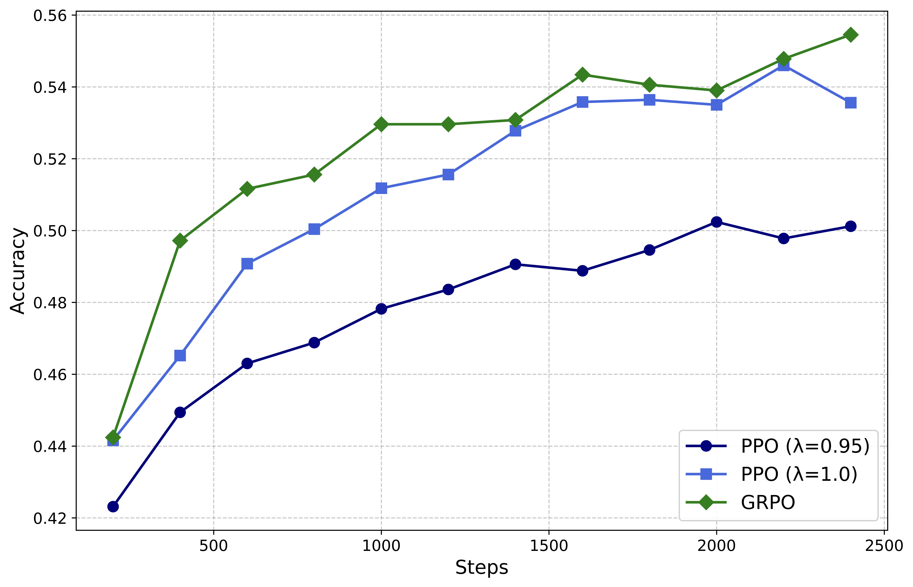

## The GRPO Algorithm {#sec-grpo-core}

::: {.callout-note collapse="true" title="Sources for this section"}

| # | Source | Summary |
|---|---|---|
| 1 | [DeepSeekMath](https://arxiv.org/abs/2402.03300) | Full GRPO objective, advantage calculation, outcome vs process supervision, iterative RL |
| 2 | [DeepSeek-R1](https://arxiv.org/abs/2501.12948) | GRPO in R1 context, PPO vs GRPO comparison |
| 3 | [Dr. GRPO](https://arxiv.org/abs/2503.20783) | GRPO as REINFORCE variant, connection to RLOO, unbiased baseline |

:::

Now Ava faces the problem from the previous section head-on. PPO works, but it requires *four* models in GPU memory (policy, critic, reference, reward model), which is impractical for her 7B parameter model on a single multi-GPU node. She needs a way to get the variance-reducing benefits of a baseline without the cost of training a separate critic network. Here is where she has her key insight.

### The Group-Relative Baseline: GRPO's Core Idea

Instead of training a separate neural network to predict the expected reward for each question, Ava estimates it empirically. For each question $q$, she generates not one but $G$ outputs: $\{o_1, o_2, \ldots, o_G\}$. She runs all $G$ SQL queries against the database and collects the rewards $\mathbf{r} = \{r_1, r_2, \ldots, r_G\}$. The mean of these rewards, $\text{mean}(\mathbf{r})$, serves as the baseline. Outputs that score above the mean are "better than average for this question" and get positive advantage; outputs that score below the mean get negative advantage.

Let us walk through a concrete example. Ava's model receives the question: "What were the total sales by region last quarter?" She samples $G = 8$ SQL queries. After executing each against the database:

| Output # | SQL Query (abbreviated) | Correct? | Reward |
|---|---|---|---|
| $o_1$ | `SELECT region, SUM(amount) FROM orders JOIN ...` | Yes | 1 |
| $o_2$ | `SELECT * FROM products WHERE quarter = 'Q3'` | No | 0 |
| $o_3$ | `SELECT region, SUM(amount) FROM orders WHERE ...` | Yes | 1 |
| $o_4$ | `SELECT region FROM orders GROUP BY region` | No | 0 |
| $o_5$ | `SELECT region, SUM(amount) FROM orders JOIN ...` | Yes | 1 |
| $o_6$ | `SELECT SUM(amount) FROM orders` | No | 0 |
| $o_7$ | `SELECT region, COUNT(*) FROM orders ...` | No | 0 |
| $o_8$ | `SELECT region, SUM(amount) FROM orders JOIN ...` | Yes | 1 |

The group mean is $\text{mean}(\mathbf{r}) = 4/8 = 0.5$. The standard deviation is $\text{std}(\mathbf{r}) = 0.535$. The normalized advantage for each output is:

$$
\hat{A}_{i,t} = \tilde{r}_i = \frac{r_i - \text{mean}(\mathbf{r})}{\text{std}(\mathbf{r})}
$$

So the four correct outputs ($r_i = 1$) each get advantage $(1 - 0.5) / 0.535 = +0.935$, and the four incorrect outputs ($r_i = 0$) each get advantage $(0 - 0.5) / 0.535 = -0.935$. The model is pushed to reinforce the token patterns that led to correct SQL (the proper joins, the correct column selections) and to penalize the patterns that led to failures (missing joins, wrong table references). No critic model needed. The group itself provides the baseline.

This is the **group-relative advantage** that gives GRPO its name. Notice how naturally it handles question difficulty. For an easy question where all 8 outputs are correct ($\mathbf{r} = \{1, 1, 1, 1, 1, 1, 1, 1\}$), the mean is 1 and the standard deviation is 0; all advantages are zero, and the model receives no gradient for this question. This makes sense: if the model already solves this question perfectly, there is nothing to learn. Conversely, for a very hard question where all outputs fail ($\mathbf{r} = \{0, 0, 0, 0, 0, 0, 0, 0\}$), the advantages are again all zero. The model cannot learn when it has no successes to reinforce.

::: {.callout-note title="Think Hard: GRPO removes the critic but introduces a new cost: generating G outputs per prompt. Under what conditions is this trade-off favorable?"}
The trade-off hinges on inference cost versus training cost. Generating $G$ outputs per prompt requires $G$ forward passes through the policy model during the *sampling* phase, which is compute-intensive but memory-light (only one model in memory at a time, used in inference mode). Training the critic in PPO requires a second model in memory *during the training phase*, which is memory-intensive. On modern GPU clusters, generating more outputs is relatively cheap because inference can be parallelized across many GPUs with frameworks like vLLM. Training a second 7B model is much harder to parallelize and requires dedicated GPU memory. The trade-off favors GRPO when: (1) the model is large (so the critic's memory cost is significant), (2) inference infrastructure is available (vLLM, SGLang), and (3) the reward is sparse (only at the end), making the critic's per-token advantage estimates unreliable anyway. In DeepSeekMath's experiments, $G = 64$ outputs per prompt achieved strong results, and the total training cost was substantially lower than PPO because the memory savings allowed larger batch sizes and fewer GPU nodes.
:::

### The Full GRPO Objective

Armed with the group-relative advantage, GRPO uses PPO's clipped surrogate objective for stability. The complete objective function, as defined in DeepSeekMath (Equation 3), is:

$$
\mathcal{J}_{GRPO}(\theta) = \mathbb{E}_{q \sim P(Q), \; \{o_i\}_{i=1}^G \sim \pi_{\theta_{old}}(\cdot \mid q)} \left[ \frac{1}{G}\sum_{i=1}^G\frac{1}{|o_i|} \sum_{t=1}^{|o_i|} \left\{ \min \left[ r_{i,t}(\theta) \hat{A}_{i,t}, \; \text{clip}(r_{i,t}(\theta), 1-\epsilon, 1+\epsilon) \hat{A}_{i,t} \right] - \beta D_{KL}[\pi_\theta \| \pi_{ref}] \right\} \right]
$$ {#eq-grpo-objective}

This looks dense, so let us unpack each piece:

1. **Group sampling**: $\{o_i\}_{i=1}^G \sim \pi_{\theta_{old}}(\cdot \mid q)$ generates $G$ outputs for each question $q$ using the old policy (a snapshot of the model from the previous iteration).

2. **Importance sampling ratio**: $r_{i,t}(\theta) = \frac{\pi_\theta(o_{i,t} \mid q, o_{i,<t})}{\pi_{\theta_{old}}(o_{i,t} \mid q, o_{i,<t})}$ measures how much each token's probability has changed since the outputs were generated. If a token is now more likely ($r > 1$), the policy has moved toward it; if less likely ($r < 1$), the policy has moved away.

3. **Group-relative advantage**: $\hat{A}_{i,t} = \frac{r_i - \text{mean}(\mathbf{r})}{\text{std}(\mathbf{r})}$ is the same for all tokens in a given output $o_i$. Under *outcome supervision*, every token gets the same advantage because the reward arrives only at the end of the sequence.

4. **Clipping**: $\text{clip}(r_{i,t}, 1-\epsilon, 1+\epsilon)$ constrains the importance ratio, preventing excessively large policy updates. The $\min$ with the clipped version creates a pessimistic bound, just as in PPO.

5. **Per-output normalization**: $\frac{1}{|o_i|}$ divides by the length of each output. This means longer outputs contribute less gradient per token than shorter ones. (We will see in @sec-grpo-variants that this introduces a bias that later variants fix.)

6. **KL regularization**: $\beta D_{KL}[\pi_\theta \| \pi_{ref}]$ penalizes the policy for deviating from the reference model, using an unbiased KL estimator:

$$
D_{KL}[\pi_\theta \| \pi_{ref}] = \frac{\pi_{ref}(o_{i,t} \mid q, o_{i,<t})}{\pi_\theta(o_{i,t} \mid q, o_{i,<t})} - \log \frac{\pi_{ref}(o_{i,t} \mid q, o_{i,<t})}{\pi_\theta(o_{i,t} \mid q, o_{i,<t})} - 1
$$ {#eq-kl-estimator}

This KL estimator (from Schulman, 2020) is guaranteed to be non-negative. Unlike PPO, which adds the KL penalty inside the reward signal, GRPO adds it directly to the loss. This separation keeps the advantage calculation clean: $\hat{A}_{i,t}$ reflects only the task reward, not the KL penalty.

{#fig-ppo-vs-grpo}

### Outcome Supervision vs. Process Supervision

GRPO supports two reward regimes that give the optimizer different granularity of feedback:

**Outcome supervision** assigns a single reward $r_i$ at the end of each output $o_i$. All tokens in the output share the same advantage: $\hat{A}_{i,t} = \tilde{r}_i$ for all $t$. This is the simpler and more common setting. For Ava's SQL task, the output is either correct or incorrect as a whole, so outcome supervision is natural.

**Process supervision** assigns rewards at intermediate steps within the output. If the model structures its reasoning into steps (separated by, say, newline characters), a process reward model can score each step independently. The advantage at token $t$ becomes the sum of normalized rewards from all subsequent steps. This provides finer-grained credit assignment: early steps that set up the correct approach receive more credit than final steps that simply format the output.

DeepSeekMath found that GRPO with process supervision (GRPO+PS) outperformed GRPO with outcome supervision (GRPO+OS) on mathematical reasoning tasks, confirming the value of step-level feedback when it is available.

::: {.callout-warning title="Common Misconception: Removing the critic sacrifices training quality"}
GRPO achieves comparable or better performance than PPO on mathematical reasoning (DeepSeekMath improved from 46.8% to 51.7% on MATH with GRPO, which matches PPO's improvements). The reason is subtle: with outcome-only rewards (a single score at the end of the sequence), the PPO critic must learn to predict this score from *every intermediate token position*, which is extremely difficult. The critic's advantage estimates are noisy in practice, often not much better than GRPO's uniform-across-tokens group advantage. GRPO trades per-token precision (which is noisy anyway) for computational simplicity and memory savings. When process rewards are available (step-level feedback), the critic's per-step advantage estimates become more accurate, and PPO's advantage narrows. But for most practical RLVR tasks with outcome-only rewards, GRPO is the better trade-off.
:::

### The Connection to REINFORCE and RLOO

GRPO may look novel, but it is fundamentally a variant of REINFORCE with a specific choice of baseline. The Dr. GRPO paper (Liu et al., 2025) made this connection precise. Starting from the Monte Carlo policy gradient (see @eq-reinforce-baseline), if we set the baseline to $B(q) = \text{mean}(\{R(q, o_1), \ldots, R(q, o_G)\})$, the resulting advantage $\tilde{A}_{i,t} = R(q, o_i) - \text{mean}(\mathbf{R})$ is exactly the unbiased group-relative advantage (without the standard-deviation normalization).

The connection goes further. The RLOO (REINFORCE Leave-One-Out) estimator uses the average reward of *the other* $G-1$ outputs as the baseline for output $i$:

$$
\hat{A}^{RLOO}_{i,t} = R(q, o_i) - \frac{1}{G-1} \sum_{j \neq i} R(q, o_j)
$$

Dr. GRPO showed that the unbiased GRPO advantage $\tilde{A}_{i,t}$ and the RLOO advantage are related by a simple scaling factor:

$$
\frac{G}{G-1} \cdot \tilde{A}_{i,t} = \hat{A}^{RLOO}_{i,t}
$$ {#eq-rloo-connection}

Since the scaling factor $G/(G-1)$ can be absorbed into the learning rate without affecting optimization dynamics, GRPO's group-relative baseline (without std normalization) is equivalent to the RLOO baseline. This is significant because RLOO is a well-studied, provably unbiased variance reduction technique from the statistics literature. GRPO did not invent a new estimator; it rediscovered an effective one in the context of LLM training.

### The Unified Paradigm: SFT, RFT, DPO, PPO, GRPO

One of the most clarifying contributions of the DeepSeekMath paper was its unified view of different training methods. All methods can be expressed through the same gradient formula:

$$
\nabla_\theta \mathcal{J}_{\mathcal{A}}(\theta) = \mathbb{E}_{(q, o) \sim \mathcal{D}} \left[ \frac{1}{|o|} \sum_{t=1}^{|o|} GC_{\mathcal{A}}(q, o, t, \pi_{rf}) \cdot \nabla_\theta \log \pi_\theta(o_t \mid q, o_{<t}) \right]
$$ {#eq-unified-paradigm}

The three key components that distinguish each method are:

| Method | Data Source | Reward Function | Gradient Coefficient |
|---|---|---|---|
| SFT | Fixed dataset of correct $(q, o)$ pairs | None | 1 (always reinforce) |
| RFT | $o \sim \pi_{sft}$, filtered by correctness | Rule-based | 1 for correct, 0 otherwise |
| DPO | Pairs $(o^+, o^-)$ from SFT model | Rule-based | Implicit preference |
| Online RFT | $o \sim \pi_\theta$ (real-time), filtered | Rule-based | 1 for correct, 0 otherwise |
| PPO | $o \sim \pi_\theta$ (real-time) | Learned model | Critic advantage |
| GRPO | $\{o_i\}_{i=1}^G \sim \pi_\theta$ (groups) | Learned model | Group-relative advantage |

This table reveals the key insight: GRPO differs from Online RFT in that it adjusts the gradient coefficient based on the *magnitude* of the reward, not just its sign. Online RFT uniformly reinforces all correct responses at the same intensity and ignores incorrect ones. GRPO reinforces *above-average* responses more strongly and actively *penalizes* below-average ones. This gradient-coefficient modulation is why GRPO outperforms Online RFT in DeepSeekMath's experiments.

::: {.callout-tip title="Self-Explanation Prompt"}
When would process supervision be preferred over outcome supervision? Think about a task where the intermediate steps matter as much as the final answer. Now think about a task where only the final answer matters (and intermediate steps are just a means to get there). Which one benefits more from process supervision?
:::

### Memory and Compute Comparison

The practical advantage of GRPO becomes clear when you compare the resource requirements:

| Aspect | PPO | GRPO |
|---|---|---|
| Models in memory | 4 (policy + critic + reference + reward) | 2 (policy + reference) |
| Memory for 7B model | ~56 GB (fp16) | ~28 GB (fp16) |
| Sampling cost | 1 output per prompt | G outputs per prompt |
| Training stability | High (critic provides per-token advantage) | High (clipping + KL regularization) |
| Reward utilization | Per-token (via critic) | Per-output (uniform advantage) |
| Math benchmark (MATH) | 51.7% (DeepSeekMath-RL) | 51.7% (DeepSeekMath-RL) |

The memory reduction from removing the critic is approximately 50%, which enables training larger models on the same hardware, or using larger batch sizes (which reduces gradient variance further). The sampling cost increases by a factor of $G$, but inference is highly parallelizable with modern frameworks like vLLM, and the additional outputs provide better gradient estimates.

For Ava, the choice is clear. With GRPO, she can train her 7B model on a single node with 4 A100 GPUs. With PPO, she would need 8 GPUs or more, and the critic would be difficult to train effectively on her sparse SQL execution rewards.

::: {.callout-note title="Think Hard: How does GRPO's group-relative baseline interact with the difficulty distribution of training questions?"}
This is a subtle point that connects to the biases discussed in @sec-grpo-variants. GRPO's baseline is the mean reward within each group, which adapts automatically to question difficulty. For easy questions (high mean reward), the baseline is high, so even correct outputs have small positive advantages. For hard questions (low mean reward), the baseline is low, so correct outputs have large positive advantages. This means GRPO naturally focuses its learning signal on "medium difficulty" questions where some outputs are correct and some are incorrect. If the training set is dominated by very easy or very hard questions, the effective gradient signal is weak because advantages are nearly zero. This self-adjusting property is generally beneficial (it prevents the model from wasting compute on questions it already solves or cannot yet solve), but it also means the training data distribution matters. DAPO's dynamic sampling (dropping questions with 0% or 100% accuracy) explicitly leverages this observation.
:::
