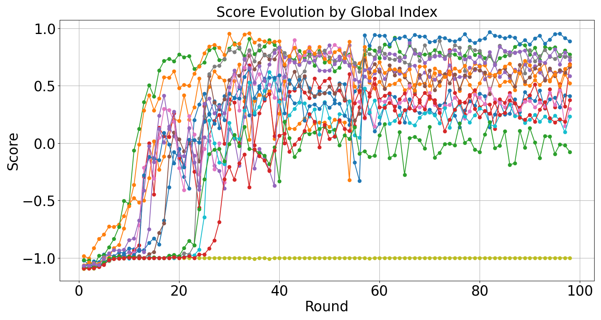

## Fixing GRPO's Failure Modes {#sec-grpo-variants}

::: {.callout-note collapse="true" title="Sources for this section"}

| # | Source | Summary |
|---|---|---|
| 1 | [DAPO](https://arxiv.org/abs/2503.14476) | Clip-Higher, Dynamic Sampling, Token-Level Loss, Overlong Reward Shaping |
| 2 | [Dr. GRPO](https://arxiv.org/abs/2503.20783) | Length bias, difficulty bias, unbiased objective, improved token efficiency |
| 3 | [REINFORCE++](https://arxiv.org/abs/2501.03262) | Batch-level normalization, PPO stabilization without critic |

:::

As Ava scales up her SQL model training with GRPO, she starts noticing something odd. After about 5,000 training steps, the model's incorrect SQL queries start getting *longer*. A wrong query that used to be 30 tokens is now 120 tokens, padded with unnecessary comments, redundant subqueries, and repeated clauses. Meanwhile, the model's correct queries are getting *shorter*. The entropy of the model's output distribution is dropping steadily: it is converging to a narrow set of "safe" patterns and losing its ability to explore novel approaches to hard queries. These are not bugs in Ava's implementation; they are fundamental issues with the GRPO algorithm that three research teams independently identified and fixed in early-to-mid 2025.

### The Three Biases of Vanilla GRPO

Let us examine each bias through the lens of GRPO's objective (@eq-grpo-objective) and understand exactly where it comes from.

**Bias 1: Response-level length bias.** Vanilla GRPO divides the loss for each output by the output's length $|o_i|$. For a correct output with positive advantage ($\hat{A}_{i,t} > 0$), dividing by a larger $|o_i|$ means each token gets a *smaller* gradient push toward higher probability. The model learns that shorter correct outputs produce stronger reinforcement per token. Conversely, for an incorrect output with negative advantage ($\hat{A}_{i,t} < 0$), dividing by a larger $|o_i|$ means each token gets a *smaller* penalty. The model learns that making incorrect outputs longer reduces the penalty per token. The combined effect: correct outputs shrink, incorrect outputs grow.

**Bias 2: Question-level difficulty bias.** GRPO normalizes advantages by dividing by $\text{std}(\mathbf{r})$, the standard deviation of the rewards within the group. For questions where all outputs have the same reward (all correct or all incorrect), $\text{std}(\mathbf{r}) \approx 0$, and the advantage magnitude explodes. A numerically stable implementation clamps this to some minimum, but the effective weight of these "trivial" questions is still disproportionately high. Very easy questions (where the model already succeeds on all $G$ outputs) and very hard questions (where it fails on all $G$ outputs) dominate the gradient, even though they carry almost no useful learning signal. Questions of medium difficulty, where some outputs succeed and some fail, get relatively less weight despite being the most informative examples for learning.

**Bias 3: Entropy collapse.** This is not a bias in the mathematical sense but an emergent pathology. PPO's symmetric clipping ($1 - \epsilon$ to $1 + \epsilon$, where $\epsilon$ is typically 0.2) constrains how much any token's probability can change in a single update. When a "good" token already has high probability (say 0.9), the upper clip allows it to go to $0.9 \times 1.2 = 1.08$ (clipped to 1.0 in practice), a near-unlimited increase. But when an "exploration" token has low probability (say 0.01), the upper clip only allows it to go to $0.01 \times 1.2 = 0.012$, a negligibly small increase. Symmetric clipping systematically favors high-probability tokens and prevents low-probability tokens from gaining traction. Over many training steps, the model collapses to a deterministic policy that always generates the same output for a given question.

{#fig-bias-illustration}

Let us now see how three variants address these issues, each with a different philosophy.

### Dr. GRPO: Remove the Biases Entirely

Dr. GRPO (Liu et al., 2025) takes the most mathematically principled approach: simply *remove* the two normalization terms that cause the biases. The key observation is that the "correct" policy gradient (see @eq-reinforce-baseline) does *not* divide by $|o_i|$ or by $\text{std}(\mathbf{r})$. These normalizations were added to GRPO for practical reasons (numerical stability, comparable loss scales across questions), but they are not required by the theory.

The Dr. GRPO objective replaces GRPO's $\hat{A}_{i,t} = \frac{R_i - \text{mean}(\mathbf{R})}{\text{std}(\mathbf{R})}$ with the unnormalized advantage $\tilde{A}_{i,t} = R_i - \text{mean}(\mathbf{R})$, and removes the $\frac{1}{|o_i|}$ length normalization. For implementation, the loss is divided by a global constant (the maximum generation length) instead of the variable response length:

```python
# GRPO (biased)
def masked_mean(tensor, mask, dim):
    return (tensor * mask).sum(axis=dim) / mask.sum(axis=dim)

# Dr. GRPO (unbiased)
def masked_mean(tensor, mask, dim):
    return (tensor * mask).sum(axis=-1) / MAX_TOKENS
```

The difference is exactly one line of code, but the impact is significant. Dr. GRPO showed that this single change:

1. **Prevents response length from growing wildly** during training (the "double increase" phenomenon where both reward and length increase simultaneously)
2. **Reduces token consumption** by preventing the model from generating excessively long incorrect responses
3. **Maintains reasoning performance** on benchmarks like AIME and MATH500

{#fig-dr-grpo-dynamics}

A surprising finding from the Dr. GRPO paper was that the "emergence of long chain-of-thought" during R1-Zero-like training may be partially an artifact of GRPO's length bias rather than a genuine capability improvement. When the bias is removed, the model still develops reasoning chains, but they are shorter and more efficient. This is a cautionary tale for the field: **not all emergent behaviors during RL training are genuine capabilities; some are optimization artifacts**.

::: {.callout-warning title="Common Misconception: Longer chain-of-thought always means better reasoning"}
Researchers initially celebrated when models trained with GRPO spontaneously generated longer and longer responses, interpreting this as "emergence of sophisticated reasoning." Dr. GRPO's analysis showed that much of this length increase comes from incorrect responses growing longer (due to the length bias), not from correct responses becoming more thorough. The unbiased estimator shows that reasoning quality can be maintained or improved while substantially reducing response length, especially for incorrect outputs. The lesson: monitor *correct* and *incorrect* response lengths separately during training. If incorrect responses are growing faster than correct ones, your optimizer may have a length bias.
:::

### DAPO: Four Targeted Fixes

While Dr. GRPO takes a theoretically motivated minimalist approach, DAPO (ByteDance, 2025) takes an engineering-driven approach, addressing each observed problem with a specific technique. The four DAPO innovations are:

**1. Clip-Higher (addressing entropy collapse).** DAPO decouples the lower and upper clipping bounds: $\text{clip}(r_{i,t}, 1 - \epsilon_{low}, 1 + \epsilon_{high})$. By setting $\epsilon_{high} > \epsilon_{low}$ (DAPO uses $\epsilon_{low} = 0.1$, $\epsilon_{high} = 0.28$), the algorithm gives low-probability tokens more room to increase their probability. This asymmetric clipping breaks the systematic suppression of exploration tokens and maintains higher entropy throughout training.

The intuition is elegant. Consider a token with probability 0.01 under the old policy. With symmetric clipping ($\epsilon = 0.2$), the maximum new probability is $0.01 \times 1.2 = 0.012$, a 20% relative increase. With Clip-Higher ($\epsilon_{high} = 0.28$), it can reach $0.01 \times 1.28 = 0.0128$, a 28% relative increase. This may seem small, but compounded over many training steps, it makes a substantial difference in maintaining the diversity of the model's output distribution.

**2. Dynamic Sampling (addressing gradient sparsity).** As training progresses, more and more questions become "too easy" (all $G$ outputs are correct) or "too hard" (all fail). For these questions, the group-relative advantage is zero for all outputs, contributing no gradient signal. This means the effective batch size shrinks over training, increasing gradient noise.

DAPO's fix is elegant: over-sample questions and filter out any where all outputs have the same reward. The training loop keeps sampling until the batch is filled with questions that have at least one correct and one incorrect output. This ensures every question in the batch contributes a non-zero gradient, maintaining sample efficiency throughout training. Mathematically, this is enforced by the constraint: $0 < |\{o_i \mid \text{is\_correct}(o_i)\}| < G$.

**3. Token-Level Loss (addressing length bias via redistribution).** DAPO addresses the length bias differently from Dr. GRPO. Instead of dividing by a constant (MAX_TOKENS), DAPO normalizes by the *total* number of tokens across all outputs in the group: $\frac{1}{\sum_{i=1}^{G} |o_i|}$. This means that each token, regardless of which output it belongs to, contributes equally to the gradient. Longer outputs contribute more tokens (and thus more gradient), while shorter outputs contribute fewer. This prevents the pathological behavior where long incorrect outputs are under-penalized.

**4. Overlong Reward Shaping (addressing truncation noise).** When outputs exceed the maximum generation length, they are truncated. Vanilla GRPO assigns a punitive reward to truncated outputs, but this can penalize good reasoning that simply ran too long. DAPO introduces a soft penalty that smoothly decreases the reward as the output approaches the maximum length:

$$
R_{length}(o) = \begin{cases}
0 & \text{if } |o| \le L_{max} - L_{cache} \\
\frac{(L_{max} - L_{cache}) - |o|}{L_{cache}} & \text{if } L_{max} - L_{cache} < |o| \le L_{max} \\
-1 & \text{if } |o| > L_{max}
\end{cases}
$$ {#eq-dapo-overlong}

This creates a "soft wall" that gradually discourages the model from generating overly long outputs without abruptly penalizing good reasoning chains that happen to be long.

{#fig-dapo-entropy}

### REINFORCE++: Back to Basics with Better Normalization

REINFORCE++ (Hu et al., 2025) takes yet another approach. Instead of fixing GRPO's group-relative advantage, it returns to the simpler REINFORCE algorithm and adds PPO's stabilization techniques (clipping, KL regularization) without the group-relative baseline. The key innovation is in how advantage normalization is performed.

REINFORCE++ normalizes advantages across the *entire batch* rather than per-question. This means the baseline is the average reward across all questions in the batch, not just the group of outputs for a single question. This eliminates the difficulty bias (since there is no per-group std normalization) but introduces a different trade-off: the baseline is less question-specific, potentially increasing variance for individual questions.

{#fig-reinforce-pp}

### Comparing the Variants: When to Use What

The following table summarizes the key differences:

| Aspect | Vanilla GRPO | Dr. GRPO | DAPO | REINFORCE++ |
|---|---|---|---|---|
| **Length normalization** | Per-output ($1/\lvert o_i \rvert$) | Per-constant ($1/L_{max}$) | Per-group total ($1/\sum \lvert o_i \rvert$) | Per-batch |
| **Advantage normalization** | Per-group (mean + std) | Per-group (mean only) | Per-group (mean + std) | Per-batch (mean + std) |
| **Clipping** | Symmetric ($\epsilon$) | Symmetric ($\epsilon$) | Asymmetric ($\epsilon_{low}, \epsilon_{high}$) | Symmetric ($\epsilon$) |
| **Entropy management** | None | None (but bias fix helps) | Clip-Higher | None |
| **Dynamic sampling** | No | No | Yes (filter 0% and 100%) | No |
| **Overlong handling** | Punitive reward | No special handling | Soft penalty (@eq-dapo-overlong) | No special handling |
| **Best for** | Simple tasks, short outputs | Any task; principled default | Long-CoT reasoning; multi-step math | When group sampling is too expensive |

In practice, the choice depends on your specific setting:

- **Dr. GRPO** is the most theoretically principled and requires the smallest code change. If you are running GRPO already, switching to Dr. GRPO is a one-line fix that eliminates the length and difficulty biases. Start here.
- **DAPO** is the best choice for long chain-of-thought training (multi-step math, complex reasoning) where entropy collapse and response length growth are primary concerns. Its four techniques work synergistically.
- **REINFORCE++** is suitable when you cannot afford the additional sampling cost of generating $G$ outputs per prompt, or when your batch is large enough that batch-level normalization provides adequate variance reduction.

::: {.callout-tip title="Self-Explanation Prompt"}
Dr. GRPO removes the std normalization and shows this is equivalent to the RLOO baseline (scaled by $G/(G-1)$). DAPO keeps the std normalization but adds dynamic sampling to filter out questions where $\text{std}(\mathbf{r}) \approx 0$. Are these two approaches solving the same problem in different ways? Under what conditions would one be strictly better than the other?
:::

For Ava's SQL task, where outputs are relatively short (50-200 tokens) and the reward is binary (correct/incorrect), Dr. GRPO's fix is likely sufficient. The length bias matters less when outputs are short, and the difficulty bias is the more pressing concern. If Ava later moves to training a "thinking" SQL model with long chain-of-thought reasoning (step-by-step query planning), DAPO's entropy management and overlong reward shaping become more relevant.
