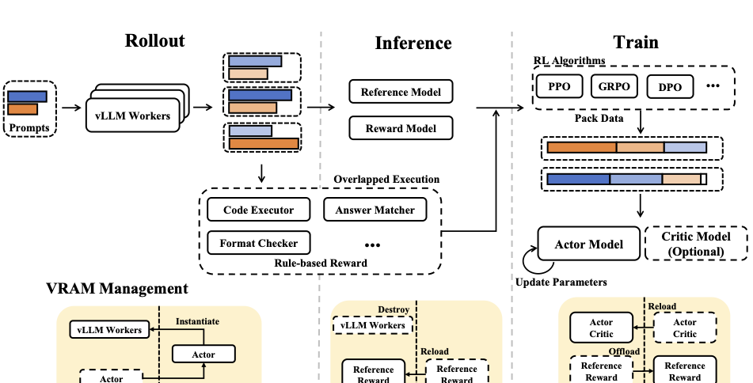

## Setting Up a GRPO Training Pipeline {#sec-grpo-environments}

::: {.callout-note collapse="true" title="Sources for this section"}

| # | Source | Summary |
|---|---|---|
| 1 | [DeepSeek-R1](https://arxiv.org/abs/2501.12948) | RL infrastructure, multi-stage pipeline, hyperparameters |
| 2 | [DeepSeekMath](https://arxiv.org/abs/2402.03300) | GRPO hyperparameters: G=64, lr=1e-6, KL=0.04 |
| 3 | [Dr. GRPO](https://arxiv.org/abs/2503.20783) | Minimal recipe on MATH L3-5, 27h on 8xA100 |
| 4 | [DAPO](https://arxiv.org/abs/2503.14476) | Training data transformation, framework recommendations |

:::

Ava now understands the theory behind GRPO and RLVR. But theory alone does not produce a working model. She needs to translate the algorithms into a running training pipeline: choose a framework, configure the reward environment, set hyperparameters, and monitor training. This section provides that practical engineering guide.

### The Four Components of a GRPO Pipeline

Every GRPO training setup has four core components. You need to understand how they interact to debug and tune effectively.

**1. The inference engine (sampling).** GRPO requires generating $G$ outputs per prompt, which means the sampling phase dominates training time. Efficient inference is critical. The three leading options are:

- **vLLM**: High-throughput inference engine with PagedAttention. Best for large-scale sampling where throughput matters more than latency.
- **SGLang**: Efficient structured generation with batch scheduling. Good for tasks that require structured outputs (JSON, SQL).
- **Naive sampling**: Using the training framework's built-in generation (e.g., HuggingFace `model.generate()`). Easier to set up but 3-5x slower than vLLM.

**2. The reward environment (verification).** For RLVR, this is the verifier. For SQL, it is a database execution sandbox. For code, a Docker container running test cases. For math, a symbolic equivalence checker. The reward environment must be deterministic, fast, and isolated (so model-generated code cannot corrupt the training server).

**3. The training engine (optimization).** The framework that computes the GRPO loss and performs gradient updates. The four leading options are:

- **TRL (Transformers Reinforcement Learning)**: Part of the HuggingFace ecosystem. Easy to configure, integrates with transformers models. Supports GRPO and its variants natively.
- **verl (Volcano Engine RL)**: High-performance framework from ByteDance. Used in DAPO's production training. Supports advanced features like pipeline scheduling between sampling and training.
- **OpenRLHF**: Focused on RLHF but supports GRPO-style training. Ray-based distributed architecture.
- **Oat**: Modular research framework from Sea AI Lab. Used in Dr. GRPO's experiments. Designed for rapid prototyping of new RL algorithms.

**4. The data pipeline (prompt management).** Manages the training prompts, ensures diversity, and handles batch construction. For DAPO's dynamic sampling, the data pipeline must support over-sampling and filtering.

{#fig-rl-infra}

::: {.exercise-order correct="B,D,A,C"}

Arrange the four steps of a single GRPO training iteration in the correct order:

- Compute group-relative advantages and clip the policy gradient update
- Sample $G$ candidate outputs per prompt using the inference engine
- Apply gradient update to the policy network weights
- Score each candidate output using the reward environment (verifier)

::: {.order-feedback}
**Correct order: B, D, A, C.** The inference engine first generates $G$ outputs per prompt. Each output is then scored by the reward environment. The group-relative advantages are computed from these scores and used to form the clipped policy gradient. Finally, the gradient update is applied to the policy weights. Scoring must happen before advantage computation (you need the rewards to compute advantages), and the gradient update is always the last step.
:::

:::

### Hyperparameter Guide

The following table summarizes the key hyperparameters with recommended ranges, drawn from published experiments across DeepSeekMath, Dr. GRPO, and DAPO:

| Hyperparameter | Symbol | DeepSeekMath | Dr. GRPO | DAPO | Recommended Start |
|---|---|---|---|---|---|
| Group size | $G$ | 64 | 8 | 16 | 16 |
| Learning rate | $\eta$ | 1e-6 | 5e-6 | 1e-6 | 1e-6 |
| Clip epsilon | $\epsilon$ | 0.2 | 0.2 | $\epsilon_{low}=0.1, \epsilon_{high}=0.28$ | 0.2 |
| KL coefficient | $\beta$ | 0.04 | 0 | 0 | 0 (for RLVR) |
| Max generation length | $L_{max}$ | 1024 | 3000 | 16384 | 2048 |
| Batch size (prompts) | $B$ | 1024 | 128 | 256 | 128 |
| PPO epochs per batch | $\mu$ | 1 | 1 | 1 | 1 |

**Group size ($G$)** is the most impactful hyperparameter. A larger $G$ gives better baseline estimates (lower variance) but increases sampling cost linearly. DeepSeekMath used $G = 64$ because they had massive compute; for most practitioners, $G = 16$ is a good balance. If your reward is binary (0/1) and the success rate is around 50%, $G = 16$ gives you enough samples to produce meaningful variance in the advantages.

**Learning rate** should be small. GRPO updates are noisy (no critic to smooth them), and large learning rates cause the policy to oscillate. Start with 1e-6 and increase cautiously. If training reward plateaus early, the learning rate may be too high: the model is overshooting optimal policies.

**KL coefficient ($\beta$)**: For pure RLVR with verifiable rewards, set $\beta = 0$ (or very small, like 0.01). KL regularization primarily prevents reward model exploitation in RLHF. In RLVR, the verifier cannot be exploited, so the KL term mainly preserves general capabilities. If you want a specialized model (SQL-only), drop it. If you want to maintain broad capabilities alongside the specific skill, keep a small $\beta$.

::: {.exercise-mcq correct="C"}

You are training a math model with GRPO. Your reward is binary (0 or 1) and the current success rate is about 30%. You set $G = 4$. What is the most likely problem with this configuration?

- The learning rate will be too high for such a small group
- The KL divergence from the reference model will explode
- Most groups will contain all-zero rewards, producing zero advantage for every sample and wasting that entire batch
- The clip epsilon will be too tight, preventing any policy update

::: {.feedback-correct}
Correct! With a 30% success rate and $G = 4$, the probability that all four samples fail is $(0.7)^4 \approx 0.24$. That means roughly one in four prompts produces a group where every output receives reward 0, making all advantages exactly zero. These "uninformative prompts" contribute nothing to learning. With $G = 64$, the probability of all failures drops to $(0.7)^{64} \approx 10^{-10}$, making uninformative prompts effectively impossible.
:::

::: {.feedback-incorrect}
Not quite. The core issue with small $G$ and low success rates is that many groups will have *identical* rewards (all zeros), producing zero advantage for every sample in the group. These uninformative prompts waste compute. With $G = 4$ and 30% success rate, about 24% of groups will be all-zero. Increasing $G$ to 16 or 64 makes it far more likely that each group contains at least one success, producing meaningful gradient signal.
:::

:::

### Monitoring Training: What to Watch

::: {.exercise-predict correct="B"}

Before reading further: which single metric would be the earliest warning sign that your GRPO-trained model is collapsing to a narrow set of outputs?

- Mean reward per batch suddenly dropping
- Entropy of the token distribution falling rapidly
- KL divergence from reference model increasing steadily

::: {.predict-reveal}
**The answer is B.** Entropy collapse, where the model's token distribution becomes sharply peaked, is the earliest signal. A model heading toward collapse first loses diversity in its outputs (low entropy) before the reward metrics visibly degrade. KL divergence increasing (option C) indicates the policy is drifting from the reference model, which is expected during training and not inherently a failure. Mean reward dropping (option A) is a late signal that appears after the damage is done.
:::

:::

Ava sets up three dashboards for her GRPO training run. Each tracks metrics that diagnose different potential issues.

**Dashboard 1: Reward metrics.**

- **Mean reward per batch**: Should increase monotonically (with noise). If it plateaus early, the model may have reached the limit of the training data difficulty or the group size is too small.
- **Reward variance (across prompts)**: Should decrease over training as the model improves on more questions. If it *increases*, the model may be catastrophically forgetting some question types while over-specializing on others.
- **Fraction of uninformative prompts**: The percentage of prompts where all $G$ outputs have the same reward. Should stay below 50%. If it exceeds 70%, use DAPO's dynamic sampling or increase $G$.

**Dashboard 2: Policy metrics.**

- **Entropy of the token distribution**: Should decrease slowly but stay above a minimum threshold. Rapid entropy decrease is a sign of entropy collapse. Consider switching to DAPO's Clip-Higher.
- **KL divergence from reference model**: If using $\beta > 0$, monitor how far the policy has drifted. Large KL (> 50 nats) suggests the model has changed substantially from its starting point.
- **Mean response length** (separate for correct and incorrect outputs): If incorrect response length is growing faster than correct response length, you have a length bias. Switch to Dr. GRPO.

**Dashboard 3: Evaluation metrics.**

- **Task accuracy on held-out test set**: The ultimate measure of success. Evaluate every 500-1000 steps.
- **Pass@k accuracy**: Sample $k$ outputs per test question and report whether *any* are correct. This metric measures the model's exploration capability, not just its greedy output quality.
- **Format compliance rate**: What fraction of outputs are in the correct format (valid SQL, parseable JSON, etc.)? This should reach 95%+ early in training.

### Common Failure Modes and Fixes

| Symptom | Likely Cause | Fix |
|---|---|---|
| Reward plateaus after initial improvement | Too-easy training data; model has learned all it can | Add harder questions; increase $G$ to capture more variance |
| Reward oscillates wildly | Learning rate too high; group size too small | Reduce $\eta$ by 2-5x; increase $G$ |
| Incorrect responses grow longer | Length bias | Switch to Dr. GRPO (remove $1/\lvert o_i \rvert$) |
| Model generates same output for all prompts | Entropy collapse | Use DAPO's Clip-Higher; reduce $\eta$ |
| Model finds reward shortcuts | Reward function too simple | Add auxiliary signals; increase verification rigor |
| Training OOM (out of memory) | $G$ too large; model too large | Reduce $G$; use gradient checkpointing; smaller batch |
| Very slow training | Sampling bottleneck | Use vLLM for inference; pipeline sampling and training |

::: {.exercise-mcq correct="D"}

During training, you observe the following symptoms: the model's greedy outputs for different prompts are nearly identical, reward has stopped improving, and the response length is very short. Consulting the failure modes table, what is the most likely diagnosis and fix?

- Length bias: the model is penalizing long outputs. Switch to Dr. GRPO.
- Reward shortcuts: the model found a simple pattern that always scores well. Add auxiliary reward signals.
- Learning rate too high: the policy is oscillating. Reduce $\eta$ by 2-5x.
- Entropy collapse: the model's output distribution has become degenerate. Use DAPO's Clip-Higher and reduce $\eta$.

::: {.feedback-correct}
Correct! Identical outputs across different prompts is the hallmark of entropy collapse: the model's token-level probability distribution has become so peaked that it generates the same (or nearly the same) sequence regardless of the input. The fix is two-fold: DAPO's Clip-Higher mechanism prevents the policy from concentrating too much probability on any single token sequence, and reducing the learning rate slows the collapse process.
:::

::: {.feedback-incorrect}
Not quite. The key symptom here is that the model generates *the same output for all prompts*. This points to entropy collapse, not length bias (which manifests as incorrect responses growing longer) or reward oscillation (which shows up as wild reward swings). Entropy collapse means the model's token distribution has become degenerate. The fix is DAPO's Clip-Higher (which prevents the policy from becoming too peaked) combined with a reduced learning rate.
:::

:::

### Ava's SQL Setup: A Concrete Example

After reading all of the above, Ava sets up her pipeline:

- **Base model**: Qwen2.5-Coder-7B-Instruct (already SFT'd on code tasks)
- **Framework**: TRL with vLLM for generation
- **Group size**: $G = 16$ (she has 4 A100 GPUs)
- **Reward**: Multi-signal SQL verifier (execution + syntax + schema, see @sec-rlvr)
- **Training data**: 12,000 natural-language-to-SQL question pairs with gold SQL answers
- **Variant**: Dr. GRPO (removes length and std normalization; a one-line code change)
- **KL coefficient**: $\beta = 0$ (pure RLVR, no need to prevent reward model exploitation)
- **Learning rate**: 1e-6 with cosine decay
- **Max generation**: 512 tokens (SQL queries are typically short)
- **Evaluation**: 1,000 held-out questions, evaluated every 500 steps

After 5,000 training steps (~8 hours on 4 A100s), the model's execution accuracy on held-out questions improves from 55% (SFT baseline) to 72%. The biggest gains are on multi-table joins and queries with complex WHERE clauses, exactly the patterns where the model previously failed. GRPO's group-relative advantage lets the model learn from comparing its own correct and incorrect SQL queries for the same question, reinforcing the join patterns that work and penalizing the ones that do not.
