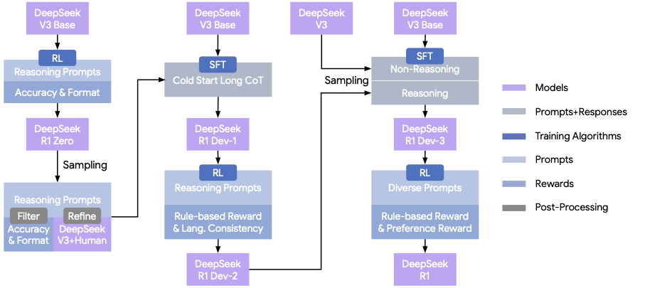

## Thinking Models and Multi-Turn Training {#sec-multi-turn}

::: {.callout-note collapse="true" title="Sources for this section"}

| # | Source | Summary |
|---|---|---|
| 1 | [DeepSeek-R1](https://arxiv.org/abs/2501.12948) | R1-Zero from base model, thinking behavior, multi-stage pipeline |
| 2 | [Dr. GRPO](https://arxiv.org/abs/2503.20783) | Aha moment in base models, template importance, RL ceiling |

:::

The most dramatic demonstration of [**GRPO**]{style="color: #4F46E5;"}'s potential came not from a carefully SFT'd model but from applying it directly to a *base model* that had never been fine-tuned on instructions. [**R1-Zero**]{style="color: #4F46E5;"} challenged a fundamental assumption: that RL requires a supervised starting point to teach LLMs anything useful.

### R1-Zero: RL Directly on a Base Model

DeepSeek-R1-Zero applied GRPO with [**rule-based rewards**]{style="color: #047857;"} (math verification) to DeepSeek-V3-Base, a mixture-of-experts model with 671 billion total parameters (37 billion activated per token). The training setup was remarkably simple: the prompt template wrapped each math problem with instructions to reason inside `<think>` tags and produce a final answer inside `<answer>` tags. No SFT data was used. No examples of correct reasoning were shown.

The results were striking. The model spontaneously developed three notable behaviors:

1. **Extended reasoning chains**: Responses grew from tens of tokens to thousands, with the model showing what appeared to be step-by-step problem decomposition.
2. **Self-reflection**: The model generated phrases like "Wait, let me reconsider" and "Hmm, that doesn't seem right," appearing to check and revise its own reasoning.
3. **Verification**: The model sometimes generated secondary calculations to verify its primary answer.

These three emergent behaviors were collectively called the "Aha moment" in the DeepSeek-R1 paper ([DeepSeek-AI, 2025](https://arxiv.org/abs/2501.12948)). The paper described it as "a sudden increase in the use of the word 'wait' during reflections," with the model generating phrases like "Wait, wait. Wait. That's an aha moment I can flag here." The authors noted: "The self-evolution of DeepSeek-R1-Zero underscores the power and beauty of RL: rather than explicitly teaching the model how to solve a problem, we simply provide it with the right incentives, and it autonomously develops advanced problem-solving strategies." These results captured the imagination of the AI research community.

::: {.exercise-predict correct="B"}

Before reading further: when researchers tested base models *before* any RL training, what did they find about the "Aha moment" behaviors (self-reflection, verification, "Wait, let me reconsider")?

- These behaviors were completely absent in base models and only appeared after RL training
- These behaviors already existed in base models at lower frequency; RL amplified rather than created them
- These behaviors appeared only in models larger than 100B parameters, regardless of training method

::: {.predict-reveal}
**The answer is B.** The Dr. GRPO team found that self-reflection keywords ("Aha," "Wait," "let me verify") already appear in base model outputs before any RL training. These patterns exist in web text that the models were pretrained on. RL does not create the behavior from scratch; it increases its frequency and (sometimes) its usefulness. This finding reframes the R1-Zero narrative: RL is a refinement tool that amplifies pre-existing capabilities, not a creation tool that produces entirely new reasoning patterns.
:::

:::

### A Critical Perspective: Were These Behaviors Truly Emergent?

The Dr. GRPO paper ([Liu et al., 2025](https://arxiv.org/abs/2503.20783)) cast important doubt on this narrative. By testing multiple base models *before* RL training, they found four key results:

1. **Self-reflection keywords already exist in base models.** DeepSeek-V3-Base, Qwen2.5 models, and even Llama-3.1 already generate "Aha," "Wait," and "let me verify" in their responses to math questions, even before any RL training. The right plot of @fig-dr-grpo-dynamics shows that self-reflection counts are non-zero for all tested base models.

2. **The "Aha moment" may be a pretraining artifact, not an emergent RL behavior.** These keywords appear in the web text that models were pretrained on. RL does not create the behavior; it amplifies and refines it, making self-reflection more frequent and (sometimes) more useful.

3. **Some base models already solve math problems without any template.** The Dr. GRPO team found that certain Qwen2.5-Math models, when given questions without any instruction template, achieved substantially higher accuracy than with the standard R1 template. This accuracy gap suggests that these models were pretrained on concatenated question-answer pairs, essentially receiving SFT through pretraining.

4. **The length increase during training is partly an optimization artifact.** As we saw in @sec-grpo-variants, GRPO's [length bias]{style="color: #E11D48;"} causes incorrect responses to grow longer, inflating average response length independently of reasoning quality. When Dr. GRPO removed this bias, the response length growth was substantially reduced while reasoning accuracy was maintained.

The Dr. GRPO findings do not diminish GRPO's effectiveness; the algorithm clearly improves performance. But the findings reframe the narrative: **RL amplifies and specializes pre-existing capabilities rather than creating entirely new ones from scratch.** The base model's pretraining determines the ceiling of what RL can achieve. RL determines how close to that ceiling the model actually gets.

::: {.callout-warning title="Common Misconception: R1-Zero proves that RL can teach LLMs to reason from scratch"}
The R1-Zero results are impressive, but the claim that reasoning emerged "from scratch" is misleading. The base model (DeepSeek-V3-Base, 671B total parameters) was pretrained on trillions of tokens including mathematical proofs, chain-of-thought examples, and self-reflective dialogue. The reasoning patterns are already encoded in the model's weights. RL did not create reasoning; it created the *incentive* for the model to use its existing reasoning capabilities more consistently.

The Dr. GRPO team's experiments with smaller models confirmed that base model capacity is the limiting factor: the DeepSeek-R1 paper found that "7B dense and 16B MoE consistently failed to yield meaningful improvements" on AIME, and only models at 32B dense and above showed "substantial performance gains attributable to pure RL training." Domain-specific pretraining substantially raised the RL ceiling. The takeaway: RL is a refinement tool, not a creation tool. Invest in pretraining and SFT data quality first, then use RL to extract the maximum performance from those capabilities.
:::

::: {.exercise-mcq correct="B"}

Based on the Dr. GRPO findings, which statement most accurately describes what RL does during R1-Zero-style training?

- RL teaches the model entirely new reasoning strategies that were impossible with pretraining alone
- RL creates incentives for the model to deploy its existing reasoning capabilities more consistently and frequently
- RL overwrites the model's pretrained knowledge with new reasoning circuits learned from reward signal
- RL only affects output formatting (the `<think>` tags) without changing the model's underlying reasoning quality

::: {.feedback-correct}
Correct! The Dr. GRPO experiments showed that self-reflection, verification, and step-by-step reasoning are already present in base model outputs at low frequency. RL does not create these behaviors; it creates the *incentive structure* that makes deploying them consistently rewarding. The base model's pretraining determines the ceiling of what RL can achieve; RL determines how close the model actually gets to that ceiling.
:::

::: {.feedback-incorrect}
Not quite. The correct answer is that RL creates incentives for consistent use of *existing* capabilities. Dr. GRPO showed that "Aha moment" behaviors (self-reflection, verification) exist in base models before any RL training. RL amplifies and specializes these pre-existing patterns rather than creating entirely new ones. The base model's pretraining quality determines the ceiling; RL closes the gap between current performance and that ceiling.
:::

:::

### The Multi-Stage Pipeline: DeepSeek-R1's Full Recipe

DeepSeek-R1 (the production model, not R1-Zero) used a four-stage pipeline that combined pure RL with SFT in a carefully orchestrated sequence:

{#fig-r1-pipeline}

1. **Cold-start SFT**: Though R1-Zero showed RL can start from a base model, the intermediate training was unstable. DeepSeek-R1 first performed SFT on "thousands of cold-start data" (long chain-of-thought examples collected by sampling from R1-Zero at temperature 1.0, filtering for correctness, and refining with human annotators) to give the model a foundation for structured reasoning.

2. **Reasoning-oriented RL**: GRPO with [**verifiable rewards**]{style="color: #047857;"} on math, coding, and logic tasks. This stage is where the model's reasoning capabilities improved most dramatically. The reward functions combined task-specific verifiers (math answer checking, code test execution) with a language consistency reward $R_{language} = \text{Num}(Words_{target}) / \text{Num}(Words)$ to prevent language mixing.

3. **Rejection sampling SFT**: After RL, the model's best outputs (sampled from the RL-trained checkpoint, filtered for correctness) were used as new SFT data, totaling approximately 600,000 reasoning samples plus 200,000 non-reasoning samples (writing, factual QA, translation). This distillation step captures the RL improvements in a cleaner model that is more stable and less prone to RL artifacts like excessive hedging or irrelevant self-reflection.

4. **Alignment RL**: A final round of 1,700 training steps with a mix of rule-based rewards (for correctness-heavy tasks) and a reward model (for helpfulness, safety, and conversational quality). To prevent reward hacking, the team "incorporated general instruction data exclusively in the final 400 steps" of this stage.

This multi-stage approach highlights an important practical pattern: **RL and SFT are complementary, not competing paradigms.** SFT provides the foundation. RL pushes performance beyond what SFT alone can achieve. Rejection sampling stabilizes the RL gains. Final RL polishes the model for deployment.

::: {.exercise-order correct="C,A,D,B"}

Arrange the four stages of the DeepSeek-R1 production pipeline in the correct order:

- Reasoning-oriented RL with task-specific verifiers (math answer checking, code execution)
- Alignment RL with a mix of rule-based rewards and a reward model for helpfulness/safety
- Cold-start SFT on a small set of long chain-of-thought examples
- Rejection sampling: use the RL-trained model's best outputs as new SFT data

::: {.order-feedback}
**Correct order: C, A, D, B.** The pipeline begins with cold-start SFT (C) to give the model a foundation for structured reasoning. Reasoning RL (A) then pushes performance using verifiable rewards. Rejection sampling (D) distills the RL gains into cleaner SFT data, stabilizing the model. Finally, alignment RL (B) adds helpfulness and safety using a mix of RLVR and RLHF. Each stage builds on the previous one: SFT provides the starting point, RL extends it, rejection sampling stabilizes it, and alignment RL polishes it.
:::

:::

### Single-Turn vs. Multi-Turn: What Changes

Ava has been training her SQL model in a *single-turn* setting: one question, one SQL output. But many real-world tasks involve multiple turns of interaction. For example:

- **Iterative query refinement**: The user asks a question, the model generates SQL, the user says "also filter by date > 2024," and the model must modify its previous SQL.
- **Tool use**: The model generates SQL, executes it (receiving results as a new input), then generates another SQL query based on those results.
- **Conversational debugging**: The model's SQL fails, it receives the error message, and it must fix the query.

Multi-turn GRPO training is conceptually straightforward but practically complex. The "output" is no longer a single SQL query but an entire conversation trajectory. The reward may apply only to the final outcome of the conversation, requiring credit assignment across multiple turns. Group sampling now generates $G$ complete trajectories per initial prompt, which is substantially more expensive than single-turn sampling.

The key practical challenges for multi-turn GRPO fall into three categories:

1. **Trajectory length**: Multi-turn conversations can be 10-100x longer than single-turn outputs, increasing memory and compute requirements.
2. **Credit assignment**: If a three-turn conversation produces correct results, which turn was most important? The [group-relative advantage]{style="color: #B45309;"} assigns the same advantage to all tokens in all turns, which may be too coarse.
3. **Environment statefulness**: Each turn may interact with an external tool (database, code execution), making the environment stateful and harder to parallelize.

::: {.exercise-mcq correct="C"}

Ava extends her SQL model to multi-turn conversations: the model generates SQL, receives execution results, and refines its query. After training with GRPO, she notices that the model improves at first-turn queries but not at refinement turns. Which multi-turn challenge best explains this?

- Trajectory length: the conversations are too long for the model's context window
- Environment statefulness: the database state changes between turns, confusing the reward signal
- Credit assignment: the group-relative advantage assigns the same score to all turns, so the model cannot learn which turn's edits actually improved the final result
- Group size: $G = 16$ is too small for multi-turn trajectories

::: {.feedback-correct}
Correct! GRPO assigns a single reward to the entire trajectory and computes a single group-relative advantage for all tokens across all turns. The model receives the same gradient signal for turn 1 (initial query) and turn 3 (refinement), even though their contributions to the final outcome differ dramatically. The model gravitates toward improving the first turn because it has the most direct influence on the reward. Refinement turns, whose value depends on the interaction history, receive a diluted learning signal. This credit assignment problem is one of the core open challenges in multi-turn RL.
:::

::: {.feedback-incorrect}
Not quite. The key issue is credit assignment. In multi-turn GRPO, the reward applies to the entire conversation trajectory, and the group-relative advantage is the same for all tokens across all turns. The model cannot distinguish which turn's edits actually drove the improvement. First-turn queries get better because they directly affect the reward; refinement turns get a diluted signal because their contribution depends on the full interaction history. This credit-assignment problem is distinct from trajectory length (a memory problem) or environment statefulness (a parallelization problem).
:::

:::

These challenges are active research areas. For Ava, the practical recommendation is to start with single-turn GRPO (simpler and faster), validate that single-turn training improves performance, and extend to multi-turn only if the task requires it.

::: {.callout-note title="Think Hard: The data quality vs. RL trade-off"}
DeepSeek-R1's multi-stage pipeline suggests that the order of training matters: SFT → RL → Rejection Sampling → SFT → RL. But what if you had unlimited high-quality SFT data? Would RL still add value? The empirical evidence says yes: RL provides improvements *beyond* what SFT can achieve because it enables the model to learn from its own mistakes, explore alternative solutions, and optimize for end-to-end task performance rather than per-token likelihood. However, the magnitude of RL's improvement depends inversely on the quality of SFT data. Excellent SFT data narrows the gap that RL needs to close. Poor SFT data makes RL's contribution larger but also makes training harder, because the model must explore from a worse starting point. The practical conclusion: invest in both, but prioritize SFT data quality first.
:::
