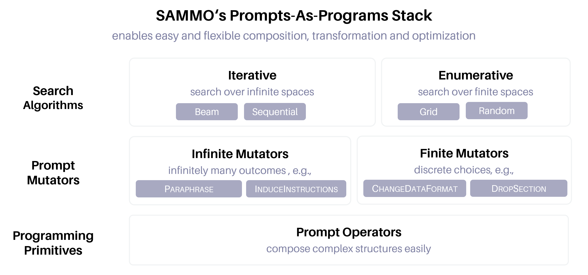
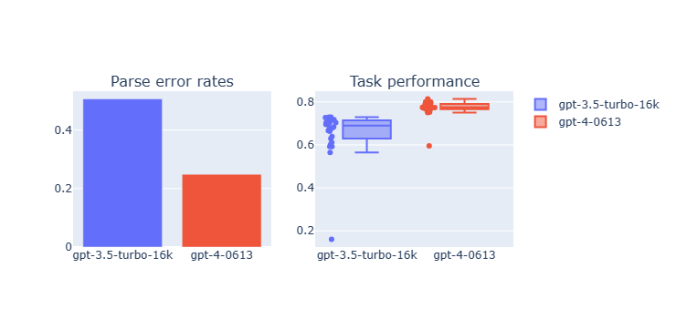

## Frameworks and the State of the Art {#sec-frameworks}

::: {.callout-note collapse="true" title="Sources for this section"}

| # | Source | Summary |
|---|---|---|
| 1 | [DSPy (2023)](https://arxiv.org/abs/2310.03714) | Programming framework, teleprompters |
| 2 | [MIPRO (2024)](https://arxiv.org/abs/2406.11695) | Bayesian optimization for pipelines |
| 3 | [TextGrad (NeurIPS 2024)](https://arxiv.org/abs/2406.07496) | PyTorch-like API |
| 4 | [TRACE (NeurIPS 2024)](https://arxiv.org/abs/2406.16218) | OPTO API, execution traces |
| 5 | [GEPA (ICLR 2026)](https://arxiv.org/abs/2507.19457) | optimize_anything API |
| 6 | [SAMMO (Microsoft, 2024)](https://arxiv.org/abs/2404.02319) | Symbolic prompt programs |
| 7 | [DSPy Optimizers Docs](https://dspy.ai/learn/optimization/optimizers/) | Full optimizer ecosystem |

:::

### Four Programming Paradigms

The algorithms from Sections @sec-first-wave through @sec-multi-objective have been packaged into production frameworks, each embodying a different abstraction for how prompt optimization should be programmed. Choosing the right framework for your use case is as important as choosing the right algorithm. This section surveys the four major paradigms and provides a decision guide.

For our triage system, we now have a complex pipeline with multiple modules, multiple objectives, and a mix of LLM calls and rule-based safety checks. Each framework would approach this system differently.

### DSPy + MIPROv2: The Programming Paradigm

DSPy ([Khattab et al., 2023](https://arxiv.org/abs/2310.03714)) treats LLM programs like traditional programs. The core abstractions:

- **Signatures**: Typed interfaces for LLM calls (e.g., `"customer_message -> urgency_level, explanation"`)
- **Modules**: Composable building blocks (`Predict`, `ChainOfThought`, `ReAct`)
- **Teleprompters (optimizers)**: Compilers that optimize the prompts within modules

MIPROv2 ([Opsahl-Ong et al., 2024](https://arxiv.org/abs/2406.11695)) is DSPy's most powerful optimizer, using a three-stage Bayesian optimization approach:

1. **Bootstrap demonstrations**: Sample training examples, run the pipeline, and collect successful execution traces as few-shot demonstrations (rejection sampling)
2. **Grounded instruction proposals**: An LLM analyzes the program code, training data, and execution traces to propose candidate instructions for each module
3. **Bayesian surrogate search**: A Tree-structured Parzen Estimator (TPE) searches the joint space of instructions and demonstrations. TPE models $p(\text{config} \mid \text{score} > \text{threshold})$ and $p(\text{config} \mid \text{score} \leq \text{threshold})$, selecting configurations that maximize the ratio (Expected Improvement).

DSPy's optimizer ecosystem has grown considerably:

| Optimizer | Strategy | Best For |
|---|---|---|
| BootstrapFewShot | Rejection sampling for few-shot examples | <10 training examples |
| BootstrapFewShotWithRandomSearch | Random search over bootstrapped demos | 10--200 examples |
| KNNFewShot | Retrieve nearest neighbors as demos | Instance-specific demos |
| COPRO | Coordinate-wise prompt optimization | Single-module instruction tuning |
| MIPROv2 | Bayesian optimization (TPE) | 200+ examples, multi-stage pipelines |
| SIMBA | Stochastic meta-ascent | Gradient-free, lightweight |
| BetterTogether | Meta-optimizer combining prompt + weight | When fine-tuning is available |
| GEPA | Pareto-based evolution with reflection | Any size, rich feedback available |

For our triage pipeline, DSPy would define signatures for each module (extraction, classification, safety checking, explanation), compose them with `ChainOfThought`, and compile with MIPROv2. The optimizer would jointly search over instructions and few-shot examples for all modules, using TPE to search the combinatorial space efficiently.

### TextGrad: The Autodiff Paradigm

TextGrad ([Yuksekgonul et al., NeurIPS 2024](https://arxiv.org/abs/2406.07496)) provides a PyTorch-like API where prompt optimization looks like neural network training. The key abstractions:

- **`Variable`**: A text string that can be optimized (like a `torch.Tensor` with `requires_grad=True`)
- **`TextLoss`**: An LLM-based evaluation function (like a loss function)
- **`TGD`**: The Textual Gradient Descent optimizer (like `torch.optim.Adam`)

The workflow mirrors PyTorch: define a computation graph of Variables and Functions, compute forward pass, compute loss, backpropagate textual gradients through the graph, update variables with TGD. Each backward pass requires $O(n)$ LLM calls for $n$ edges in the computation graph.

TextGrad's strength is **instance-level optimization**: it can refine a specific code solution, molecule design, or treatment plan at test time, not just compile-time prompt optimization. Its limitation: single-loss only (no native multi-objective support), and the backward pass cost scales with graph complexity.

For our triage system, TextGrad would be ideal for test-time refinement: when a particularly difficult ticket is misclassified, run TextGrad to refine the classification by propagating feedback from the evaluation ("this was a safety-critical case") back through the pipeline.

### TRACE: The Execution-Trace Paradigm

TRACE ([Nie et al., NeurIPS 2024](https://arxiv.org/abs/2406.16218)) wraps Python code to automatically capture execution DAGs. Two primitives:

- **`node`**: Wraps Python objects as computational graph nodes. Nodes marked trainable become optimization parameters.
- **`@bundle`**: Decorator that turns methods into graph operators, recording their docstrings and source code.

The OptoPrime algorithm converts the captured execution trace (the minimal subgraph connecting parameters to output) into pseudo-code, then prompts an LLM with ReAct-style reasoning to suggest parameter updates. Because TRACE captures the actual execution (including branching, loops, and non-LLM operations like rule-based safety checks), it handles heterogeneous workflows that TextGrad's purely LLM-based computation graph cannot represent.

For our triage system, TRACE would be the natural choice if the pipeline mixes LLM calls with rule-based safety logic (hard-coded medical emergency keywords, regex-based financial urgency detection). TRACE captures the full execution trace including these non-LLM components, allowing the optimizer to understand how they interact.

### GEPA + optimize_anything: The Universal Optimizer

GEPA's ([Agrawal et al., ICLR 2026](https://arxiv.org/abs/2507.19457)) `optimize_anything` API represents the most ambitious abstraction: a single declarative interface for any text optimization problem. Three unified modes:

- **Single-task search**: Solve one hard problem (circle packing, blackbox optimization). Each evaluation is a new attempt.
- **Multi-task search**: Solve related problems with cross-task transfer. Improvements on one CUDA kernel transfer to others.
- **Generalization**: Build skills that transfer to unseen examples. This is classical prompt optimization (AIME math, ARC-AGI agent architecture).

The key concept is **ASI (Actionable Side Information)**: diagnostic feedback that the optimizer LLM reads during reflection. This can be compiler errors, profiler traces, rendered images, structured scores, execution logs, or any domain-specific signal. ASI is what makes GEPA so broadly applicable: the same algorithm works for CUDA kernel optimization (ASI = compilation output + runtime profiling) and math reasoning (ASI = step-by-step error analysis).

GEPA also supports **Pareto-efficient search** natively, both for per-instance diversity (as described in @sec-multi-objective) and for explicit multi-metric optimization through the `scores` field in ASI.

For our triage system at full scale (multi-module pipeline with code and prompt components), GEPA's `optimize_anything` would treat the entire system as a text artifact, using execution traces as ASI, and evolve both the prompts and the code simultaneously.

SAMMO ([Ribeiro et al., 2024](https://arxiv.org/abs/2404.02319)) represents prompts as symbolic DAGs and applies structural mutations (drop section, repeat section, change format) alongside textual mutations.

{#fig-sammo}

{#fig-sammo-headroom}

### Emerging Methods

Several newer frameworks push the boundaries:

**PromptWizard (Microsoft, ACL 2025 Findings)** uses a 4-stage self-evolving mechanism: mutate instructions, score on training data, critique failures, synthesize improvements. It jointly optimizes instructions and few-shot examples, generating chain-of-thought reasoning steps automatically. Improvements across 45 tasks with reduced API cost.

**PhaseEvo** combines LLM mutation with multi-phase global search, balancing local refinement and global exploration across 35 benchmark tasks.

**C-MOP (February 2026)** enables small 3B-parameter models to surpass larger domain-specific systems by 1.58--3.35% through boundary-aware contrastive sampling and momentum-guided semantic clustering.

**IAPO (Inference-Aware Prompt Optimization)** jointly optimizes the prompt AND inference configuration (temperature, Best-of-N sampling, top-$p$). This expands the optimization problem beyond prompt text to include deployment parameters. The same prompt performs differently at temperature 0 vs. 0.7; IAPO searches over both simultaneously.

### Framework Comparison

| Dimension | DSPy/MIPROv2 | TextGrad | TRACE | GEPA | SAMMO |
|---|---|---|---|---|---|
| **Core abstraction** | Programming (signatures, modules) | Autodiff (variables, loss, gradients) | Execution traces (nodes, bundles) | Universal text optimization | Symbolic programs (DAGs) |
| **Optimization target** | Instructions + demonstrations | Any text variable | Any parameter (text, code, config) | Any text artifact | Prompt structure + content |
| **Search strategy** | Bayesian (TPE) | Textual gradient descent | Trace-guided LLM reasoning | Reflection + Pareto evolution | Beam search with structural mutations |
| **Multi-objective?** | No (single metric) | No (single loss) | No (single feedback) | Yes (Pareto-efficient) | Yes (cost vs. accuracy) |
| **Pipeline support?** | Native (multi-module) | Computation graphs | Arbitrary DAGs | Agent architecture evolution | DAG prompt programs |
| **Multimodal?** | Partial | No | No | Via ASI | No |
| **Open-source?** | Yes | Yes | Yes | Yes (via DSPy) | Yes |
| **Best for** | Multi-stage pipelines with training data | Test-time refinement of individual cases | Heterogeneous workflows with non-LLM components | End-to-end optimization, rich feedback domains | Prompt compression and structural tuning |

### Decision Guide

Use this flowchart to select the right framework:

**Single prompt vs. multi-stage pipeline?**

- Single prompt: OPRO, GPO, or EvoPrompt (simpler, faster)
- Pipeline: DSPy/MIPROv2, TRACE, or GEPA

**How much training data?**

- <10 examples: BootstrapFewShot
- 10--200 examples: BootstrapFewShotWithRandomSearch
- 200+ examples: MIPROv2
- Any amount: GEPA

**Single vs. multi-objective?**

- Single: any framework
- Multi: GEPA, SAMMO, or custom NSGA-II (e.g., MOPO)

**Instance-level vs. prompt-level optimization?**

- Instance-level (test-time refinement): TextGrad
- Prompt-level (compile-time optimization): DSPy, GEPA

**Need to optimize code/architecture too?**

- Yes: GEPA `optimize_anything` or TRACE
- No: DSPy/MIPROv2

**Budget for LLM calls?**

- Low (<100): BootstrapFewShot
- Medium (100--1,000): GEPA
- High (1,000+): MIPROv2 heavy mode

```{.d2}
direction: down
vars: {
  d2-config: {
    layout-engine: elk
  }
}

classes: {
  base: {
    style: {
      fill: "white"
      stroke: "#E5E7EB"
      stroke-width: 2
      shadow: true
      border-radius: 8
      font-size: 13
    }
  }
  decision: {
    style: {
      stroke: "#F59E0B"
      fill: "#FFFBEB"
      font-color: "#92400E"
      shape: diamond
    }
  }
  output: {
    style: {
      fill: "#3B82F6"
      stroke: "#1D4ED8"
      font-color: "white"
    }
  }
}

Q1: "Single prompt or\nmulti-stage pipeline?" {
  class: [base; decision]
}
single: "   OPRO / GPO / EvoPrompt   " {
  class: [base; output]
}
Q2: "Need to optimize\ncode/architecture?" {
  class: [base; decision]
}
code_yes: "  GEPA optimize_anything  " {
  class: [base; output]
}
Q3: "Multi-objective?" {
  class: [base; decision]
}
moo: "  GEPA / SAMMO / MOPO  " {
  class: [base; output]
}
Q4: "Heterogeneous workflow?\n(non-LLM components)" {
  class: [base; decision]
}
trace: "       TRACE       " {
  class: [base; output]
}
dspy: " DSPy / MIPROv2 " {
  class: [base; output]
}

Q1 -> single: "Single" {style.font-size: 11}
Q1 -> Q2: "Pipeline" {style.font-size: 11}
Q2 -> code_yes: "Yes" {style.font-size: 11}
Q2 -> Q3: "No" {style.font-size: 11}
Q3 -> moo: "Yes" {style.font-size: 11}
Q3 -> Q4: "No" {style.font-size: 11}
Q4 -> trace: "Yes" {style.font-size: 11}
Q4 -> dspy: "No" {style.font-size: 11}
```

::: {.callout-note title="Think Hard: Does one framework subsume all the others?"}
GEPA's `optimize_anything` claims to unify prompt optimization, code optimization, and agent architecture search. In a sense, any text artifact (prompts, code, configurations) can be treated as a string to evolve. But specialization matters. DSPy's signature abstraction captures multi-stage pipeline structure that GEPA's flat text representation misses. TextGrad's backward pass provides targeted per-component feedback that GEPA's reflection-based approach approximates more coarsely. TRACE's execution trace captures non-LLM components that are invisible to text-only optimization. The right framework depends on which structure in your problem you want the optimizer to exploit. A universal optimizer that ignores problem structure may be less effective than a specialized one that leverages it.
:::

::: {.callout-tip title="Self-Explanation Prompt"}
DSPy optimizes demonstrations (few-shot examples) while TextGrad optimizes instructions. For our triage system, when would optimizing examples be more effective than optimizing the instruction itself? Consider data availability, task complexity, and model capability.
:::
